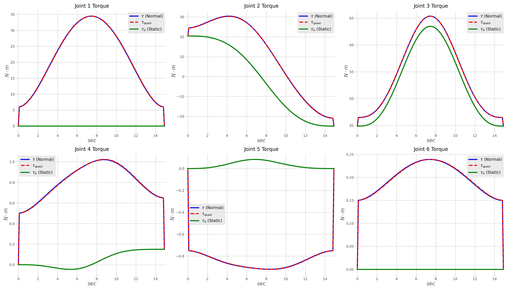

# Lab 1 — Dynamic Model of a Multi-Link Manipulator (Stanford Arm)


> **Course:** Robot Motion Planning and Control — Faculty of Control Systems and Robotics, ITMO University <br>
> **Author:** Umer Ahmed Baig Mughal — MSc Robotics and Artificial Intelligence <br>
> **Topic:** Stanford Arm · Denavit-Hartenberg Parameters · Newton-Euler Inverse Dynamics · Mass Matrix · Coriolis Matrix · Gravity Vector · Joint-Space Trajectory Planning

---

## Table of Contents

1. [Objective](#objective)
2. [Theoretical Background](#theoretical-background)
   - [Problem Formulation: Inverse Dynamics of a Multi-Link Manipulator](#problem-formulation-inverse-dynamics-of-a-multi-link-manipulator)
   - [Denavit-Hartenberg Representation](#denavit-hartenberg-representation)
   - [Newton-Euler Recursive Algorithm](#newton-euler-recursive-algorithm)
   - [Dynamic Equation Components: M(q), C(q, q̇), G(q)](#dynamic-equation-components-mq-cq-q̇-gq)
   - [Joint-Space Trajectory Planning](#joint-space-trajectory-planning)
   - [System Properties](#system-properties)
3. [Robot Model and Dynamic Parameters](#robot-model-and-dynamic-parameters)
   - [Stanford Arm — DH Parameter Table](#stanford-arm--dh-parameter-table)
   - [Dynamic Parameter Specification](#dynamic-parameter-specification)
   - [Three Inverse Dynamics Scenarios](#three-inverse-dynamics-scenarios)
4. [System Parameters](#system-parameters)
   - [Link Mass and Centre of Mass](#link-mass-and-centre-of-mass)
   - [Inertia Tensors](#inertia-tensors)
   - [Actuator Parameters](#actuator-parameters)
   - [Trajectory Parameters](#trajectory-parameters)
5. [Implementation](#implementation)
   - [File Structure](#file-structure)
   - [Function Reference](#function-reference)
   - [Algorithm Walkthrough](#algorithm-walkthrough)
6. [How to Run](#how-to-run)
7. [Results](#results)
8. [Analysis and Conclusions](#analysis-and-conclusions)
9. [Dependencies](#dependencies)
10. [Notes and Limitations](#notes-and-limitations)
11. [Author](#author)
12. [License](#license)

---

## Objective

This lab constructs and analyses the complete **dynamic model of the Stanford Arm** — a classical 6-DOF manipulator with a unique RRPRRR joint configuration (five revolute joints plus one prismatic joint) — using Peter Corke's Robotics Toolbox for Python. The model is fully parameterized with physically motivated link masses, centres of mass, inertia tensors, motor inertias, friction coefficients, gear ratios, and joint limits. Inverse dynamics are then solved using the Newton-Euler recursive algorithm for three distinct motion scenarios, and the components of the fundamental dynamic equation are extracted and examined numerically at representative trajectory points.

The key learning outcomes are:

- Loading a standard manipulator model from the Robotics Toolbox (`rtb.models.DH.Stanford()`), reading and interpreting its **Denavit-Hartenberg parameter table**, and understanding the significance of each DH parameter — joint angle θ, link offset d, link length a, and twist angle α — in defining the kinematic chain.
- Overwriting the toolbox default dynamic parameters with physically motivated values drawn from manipulator datasheets, covering all six links: **link masses**, **centres of mass** relative to link frames, **inertia tensors** in diagonal form [Ixx, Iyy, Izz, Ixy, Iyz, Ixz], **motor inertias** Jm, **viscous friction coefficients** B, **Coulomb friction pairs** [Tc⁺, Tc⁻], and **gear ratios** G.
- Understanding the distinction between revolute and **prismatic joint parameters** — specifically that Joint 3 of the Stanford Arm is prismatic with limits expressed in metres rather than radians, and that its inverse dynamics output is a force (Newtons) rather than a torque (N·m).
- Specifying arbitrary **initial and final joint configurations**, visualising both in 3D using `robot.plot()`, and planning a smooth minimum-jerk **joint-space trajectory** between them using `rtb.jtraj()` — a quintic polynomial interpolator guaranteeing zero velocity and acceleration at the trajectory endpoints.
- Solving the **inverse dynamics problem** using `robot.rne()` — the recursive Newton-Euler algorithm — under three physically distinct scenarios: full dynamics ($\dot{q} \neq 0,\; \ddot{q} \neq 0$), quasi-static motion ($\dot{q} \neq 0,\; \ddot{q} = 0$), and static hold ($\dot{q} = 0,\; \ddot{q} = 0$), and understanding the physical meaning of each scenario in terms of which dynamic contributions are active.
- Computing and interpreting the three fundamental **dynamic equation matrices** at a representative midpoint of the trajectory: the symmetric positive-definite mass matrix $M(q)$ (inertia), the velocity-dependent Coriolis matrix $C(q, \dot{q})$, and the configuration-dependent gravity vector $G(q)$ — using `robot.inertia()`, `robot.coriolis()`, and `robot.gravload()` respectively.
- Plotting **joint torque (and force) time histories** for all six joints across the 15-second trajectory for each of the three scenarios — comparing the Normal, Quasi-static, and Static profiles to identify the contributions of inertial, Coriolis, gravitational, and friction terms to the total actuation effort.

The lab is implemented as a single Jupyter notebook (`Stanford_Arm_Inverse_Dynamics.ipynb`) running on Python 3.11, producing robot configuration plots, printed DH and dynamic parameter tables, numerical dynamic matrices, and a 6-panel joint torque/force figure.

---

## Theoretical Background

### Problem Formulation: Inverse Dynamics of a Multi-Link Manipulator

The **inverse dynamics problem** asks: given a desired trajectory in joint space — a sequence of positions $q(t)$, velocities $\dot{q}(t)$, and accelerations $\ddot{q}(t)$ — what joint torques (and forces, for prismatic joints) must the actuators produce to execute that trajectory? This is the reverse of the forward dynamics problem (given torques, find motion) and is essential for feedforward controller design, simulation, and model-based control.

For an $n$-DOF rigid-body manipulator, the equations of motion in joint space take the standard form:

```
τ = M(q) q̈  +  C(q, q̇) q̇  +  G(q)  +  F(q̇)

where:
    τ         — joint torque / force vector  (n×1)
    M(q)      — configuration-dependent mass (inertia) matrix  (n×n), symmetric positive-definite
    C(q, q̇)  — Coriolis and centrifugal matrix  (n×n)
    G(q)      — gravitational load vector  (n×1)
    F(q̇)     — friction terms (viscous B·q̇ + Coulomb Tc·sign(q̇))
```

The three inverse dynamics scenarios explored in this lab isolate different subsets of this equation:

| Scenario | q̇ | q̈ | Active terms | Physical meaning |
|----------|----|-----|--------------|-----------------|
| **Full dynamics** | ≠ 0 | ≠ 0 | M q̈ + C q̇ + G + F | Complete actuation — inertia, Coriolis, gravity, friction all active |
| **Quasi-static** | ≠ 0 | = 0 | C q̇ + G + F | Slow motion — inertia neglected; Coriolis, gravity, friction remain |
| **Static hold** | = 0 | = 0 | G only | No motion — only gravity must be balanced; reveals minimum holding torques |

### Denavit-Hartenberg Representation

The **Denavit-Hartenberg (DH) convention** provides a systematic, minimal representation of any serial manipulator's geometry using exactly four parameters per joint:

```
Parameter  Symbol  Meaning
─────────────────────────────────────────────────────────────────────
θⱼ         theta   Rotation about the previous z-axis  (joint variable for revolute joints)
dⱼ         d       Translation along the previous z-axis  (joint variable for prismatic joints)
aⱼ         a       Translation along the new x-axis  (link length)
αⱼ         alpha   Rotation about the new x-axis  (link twist)
```

For a revolute joint, θⱼ is the joint variable (changes during motion); all others are fixed geometric constants. For a prismatic joint (Joint 3 of the Stanford Arm), dⱼ is the joint variable while θⱼ is a fixed constant. The complete pose of frame {j} relative to frame {j−1} is given by the homogeneous transformation:

```
ᵀⱼ₋₁Tⱼ = Rz(θⱼ) · Tz(dⱼ) · Tx(aⱼ) · Rx(αⱼ)
```

The **standard DH** convention (as opposed to modified/Craig DH) is used in the Robotics Toolbox's `rtb.models.DH` family, which means the z-axis of frame {j} is the axis of joint {j+1}.

### Newton-Euler Recursive Algorithm

The `robot.rne()` method implements the **Recursive Newton-Euler (RNE) algorithm** (Luh, Walker, and Paul, 1980), which computes inverse dynamics in two passes through the kinematic chain:

**Outward pass (base → end-effector) — kinematics propagation:**
```
For each link j = 1 to n:
    Propagate angular velocity:     ωⱼ  =  ωⱼ₋₁ + θ̇ⱼ ẑⱼ
    Propagate angular acceleration: ω̇ⱼ  =  ω̇ⱼ₋₁ + θ̈ⱼ ẑⱼ + θ̇ⱼ (ωⱼ₋₁ × ẑⱼ)
    Propagate linear acceleration:  v̈ⱼ  =  ω̇ⱼ × pⱼ + ωⱼ × (ωⱼ × pⱼ) + v̈ⱼ₋₁
    Compute CoM acceleration:       v̈cⱼ =  ω̇ⱼ × rcⱼ + ωⱼ × (ωⱼ × rcⱼ) + v̈ⱼ
```

**Inward pass (end-effector → base) — force/torque propagation:**
```
For each link j = n to 1:
    Newton equation:   Fⱼ  =  mⱼ v̈cⱼ                         (net force on link j)
    Euler equation:    Nⱼ  =  Iⱼ ω̇ⱼ + ωⱼ × (Iⱼ ωⱼ)         (net moment on link j)
    Balance:           fⱼ  =  fⱼ₊₁ + Fⱼ
                       nⱼ  =  Nⱼ + nⱼ₊₁ + pⱼ × fⱼ + rcⱼ × Fⱼ
    Joint torque:      τⱼ  =  nⱼᵀ ẑⱼ  +  Jmⱼ Gⱼ² q̈ⱼ  +  Bⱼ Gⱼ² q̇ⱼ  +  Tc·sign(q̇ⱼ)
```

The motor inertia (`Jm`), gear ratio (`G`), viscous friction (`B`), and Coulomb friction (`Tc`) terms are incorporated directly into the joint torque calculation — making `robot.rne()` a complete actuator-level torque model, not merely a rigid-body dynamics solver.

### Dynamic Equation Components: M(q), C(q, q̇), G(q)

The three fundamental dynamic matrices are computed by the Robotics Toolbox through these API calls:

**Mass matrix $M(q)$** — `robot.inertia(q)`:
```
M(q) ∈ ℝ^{n×n}  — symmetric, positive-definite
Mᵢⱼ(q) = contribution of joint j acceleration to joint i torque
Diagonal entries Mᵢᵢ: effective inertia of link i seen at joint i
Off-diagonal Mᵢⱼ: inertial coupling between joints i and j
```

**Coriolis matrix $C(q, \dot{q})$** — `robot.coriolis(q, qd)`:
```
C(q, q̇) ∈ ℝ^{n×n}
(C q̇)ᵢ = centripetal and Coriolis torques at joint i
C → 0  when  q̇ → 0  (Coriolis terms vanish at zero velocity)
```

**Gravity vector $G(q)$** — `robot.gravload(q)`:
```
G(q) ∈ ℝ^n
Gᵢ(q) = torque/force at joint i required to balance gravity alone
Depends only on configuration q, not on velocity or acceleration
```

These three quantities relate to the full equation of motion as:
```
τ = M(q) q̈ + C(q, q̇) q̇ + G(q)
```

where friction terms are additionally included in `robot.rne()` but not in the individual matrix functions.

### Joint-Space Trajectory Planning

`rtb.jtraj(q_start, q_end, t)` generates a **quintic (5th-order) polynomial trajectory** in joint space — also known as a minimum-jerk trajectory. The polynomial is constructed to satisfy six boundary conditions:

```
At t = t_start:  q = q_start,  q̇ = 0,  q̈ = 0
At t = t_stop:   q = q_end,    q̇ = 0,  q̈ = 0
```

This guarantees smooth starts and stops with no impulsive torques at the trajectory endpoints. The resulting trajectory object `tr` exposes three arrays:

```python
tr.q    # Joint positions     — shape (N, 6),  units: rad (revolute) / m (prismatic)
tr.qd   # Joint velocities    — shape (N, 6),  units: rad/s / m/s
tr.qdd  # Joint accelerations — shape (N, 6),  units: rad/s² / m/s²
```

### System Properties

| Property | Value | Notes |
|----------|-------|-------|
| Robot | Stanford Arm | By Victor Scheinman, Stanford University, 1969 |
| Joint configuration | RRPRRR | 5 revolute + 1 prismatic (Joint 3) |
| DOF | 6 | |
| DH convention | Standard (not modified) | `rtb.models.DH.Stanford()` |
| Trajectory method | `rtb.jtraj()` | Quintic polynomial, joint-space |
| Trajectory duration | 15 seconds | `t_stop = 15` |
| Trajectory points | 150 | `N = 150`, step = 0.1 s |
| Inverse dynamics method | Newton-Euler RNE | `robot.rne()` |
| Dynamic matrix evaluation | Midpoint t = 7.5 s | Index 75 of 150 |
| Gravity direction | −z (default) | Standard robotics toolbox convention |
| Friction model | Viscous + Coulomb | Included in `robot.rne()` via B, Tc, G parameters |
| Platform | Local Jupyter | Python 3.11.2 |

---

## Robot Model and Dynamic Parameters

### Stanford Arm — DH Parameter Table

The Stanford Arm is loaded directly from the Robotics Toolbox: `robot = rtb.models.DH.Stanford()`. Its standard DH parameters as reported by `print(robot)` are:

| Joint | Type | θⱼ | dⱼ (m) | aⱼ (m) | αⱼ | q⁻ (lower limit) | q⁺ (upper limit) |
|:-----:|:----:|:--:|:-------:|:-------:|:--:|:-----------------:|:-----------------:|
| 1 | Revolute | q1 | 0.412 | 0 | −90° | −170° (−2.97 rad) | +170° (+2.97 rad) |
| 2 | Revolute | q2 | 0.154 | 0 | +90° | −170° (−2.97 rad) | +170° (+2.97 rad) |
| 3 | **Prismatic** | −90° | **q3** | 0.0203 | 0° | 0.305 m | 1.270 m |
| 4 | Revolute | q4 | 0 | 0 | −90° | −170° (−2.97 rad) | +170° (+2.97 rad) |
| 5 | Revolute | q5 | 0 | 0 | +90° | −90° (−1.57 rad) | +90° (+1.57 rad) |
| 6 | Revolute | q6 | 0 | 0 | 0° | −170° (−2.97 rad) | +170° (+2.97 rad) |

**Key architectural feature:** Joint 3 is **prismatic** — it translates along the z-axis of frame 2 rather than rotating. Its joint variable is the link offset `d3` (extension distance in metres). As a result, the inverse dynamics output for Joint 3 is a **force in Newtons** (not N·m), and its joint limits are expressed in metres (`[0.305, 1.270]` m as defined in the original model, overridden to `[0, 0.5]` m in this implementation).

The toolbox also defines two named configurations: `qr = qz = [0, 0, 0, 0, 0, 0]` — both default to the zero configuration.

### Dynamic Parameter Specification

All dynamic parameters are manually assigned after loading the model, overwriting the toolbox defaults. The original default values for Link 0 (from `robot.links[0].dyn()`) before overwriting were: m=9.3, r=[0, 0.018, −0.11], I=[0.28, 0.26, 0.071], Jm=0.95, B=0, Tc=[0,0], G=1.

The updated parameters across all six links are:

**Link masses, centres of mass, and inertia tensors:**

| Link | Role | Mass (kg) | CoM x (m) | CoM y (m) | CoM z (m) | Ixx (kg·m²) | Iyy (kg·m²) | Izz (kg·m²) |
|:----:|:----:|:---------:|:---------:|:---------:|:---------:|:-----------:|:-----------:|:-----------:|
| 0 | Base | 9.29 | 0 | 0 | 0.10 | 0.100 | 0.100 | 0.050 |
| 1 | Shoulder | 5.01 | 0 | −0.02 | 0.12 | 0.050 | 0.200 | 0.150 |
| 2 | Elbow (prismatic) | 4.25 | 0 | 0 | 0.25 | 0.010 | 0.010 | 0.020 |
| 3 | Wrist 1 | 1.08 | 0 | 0.01 | 0.02 | 0.005 | 0.003 | 0.004 |
| 4 | Wrist 2 | 0.63 | 0 | 0 | 0.01 | 0.002 | 0.002 | 0.001 |
| 5 | End-effector | 0.51 | 0 | 0 | 0.03 | 0.001 | 0.001 | 0.001 |

All off-diagonal inertia tensor elements (Ixy, Iyz, Ixz) are set to zero — diagonal approximation valid for symmetric link geometries.

**Actuator and friction parameters:**

| Link | Role | Jm (kg·m²) | B (N·m·s/rad) | Tc⁺ (N·m) | Tc⁻ (N·m) | Gear Ratio G |
|:----:|:----:|:----------:|:-------------:|:---------:|:---------:|:------------:|
| 0 | Base | 0.000200 | 0.0100 | +0.050 | −0.060 | 120 |
| 1 | Shoulder | 0.000200 | 0.0080 | +0.040 | −0.050 | 100 |
| 2 | Elbow (P) | 0.000100 | 0.0050 | +0.020 | −0.030 | 80 |
| 3 | Wrist 1 | 0.000050 | 0.0010 | +0.010 | −0.015 | 50 |
| 4 | Wrist 2 | 0.000050 | 0.0010 | +0.010 | −0.015 | 50 |
| 5 | End-effector | 0.000030 | 0.0005 | +0.005 | −0.010 | 30 |

Notes: Asymmetric Coulomb friction [Tc⁺, Tc⁻] models different resistances for positive and negative motion directions — a physical property of real gearboxes. Gear ratios decrease from base (120:1) to end-effector (30:1), reflecting the decreasing torque requirements toward the wrist.

**Joint limits (overridden values):**

| Link | Lower | Upper | Unit |
|:----:|:-----:|:-----:|:----:|
| 0 | −π (−3.142) | +π (+3.142) | rad |
| 1 | −π | +π | rad |
| 2 | 0 | 0.5 | **m** (prismatic) |
| 3 | −π | +π | rad |
| 4 | −π | +π | rad |
| 5 | −π | +π | rad |

### Three Inverse Dynamics Scenarios

The `robot.rne(q, qd, qdd)` function computes joint torques for any given $(q, \dot{q}, \ddot{q})$ triplet. Three calls are made covering the required scenarios:

```python
# Scenario 1 — Full dynamics: q̇ ≠ 0, q̈ ≠ 0
# All dynamic terms active: inertia + Coriolis + gravity + friction
tau       = robot.rne(tr.q, tr.qd, tr.qdd).T         # shape (6, 150)

# Scenario 2 — Static hold: q̇ = 0, q̈ = 0
# Only gravitational load: τ = G(q) + Tc·sign(0) ≈ G(q)
tau0      = robot.rne(tr.q, np.zeros([N,6]), np.zeros([N,6])).T

# Scenario 3 — Quasi-static: q̇ ≠ 0, q̈ ≈ 0
# Inertial term M·q̈ removed; Coriolis + gravity + friction remain
tau_quasi = robot.rne(tr.q, tr.qd, np.zeros([N,6])).T
```

The trajectory `tr.q` is used as the configuration sequence in all three cases — meaning all three scenarios trace the same path in joint space, differing only in whether velocity and/or acceleration contributions are included. The `.T` transpose reshapes the output from `(N, 6)` to `(6, N)` for convenient per-joint indexing as `tau[i]`.

---

## System Parameters

### Link Mass and Centre of Mass

| Parameter | Joint 1 (Base) | Joint 2 (Shoulder) | Joint 3 (Elbow) | Joint 4 (Wrist 1) | Joint 5 (Wrist 2) | Joint 6 (EE) |
|-----------|:--------------:|:------------------:|:---------------:|:-----------------:|:-----------------:|:------------:|
| Mass m (kg) | 9.29 | 5.01 | 4.25 | 1.08 | 0.63 | 0.51 |
| CoM rₓ (m) | 0.000 | 0.000 | 0.000 | 0.000 | 0.000 | 0.000 |
| CoM r_y (m) | 0.000 | −0.020 | 0.000 | 0.010 | 0.000 | 0.000 |
| CoM r_z (m) | 0.100 | 0.120 | 0.250 | 0.020 | 0.010 | 0.030 |

### Inertia Tensors

All tensors are diagonal (Ixy = Iyz = Ixz = 0):

| Tensor Component | Joint 1 | Joint 2 | Joint 3 | Joint 4 | Joint 5 | Joint 6 |
|:----------------:|:-------:|:-------:|:-------:|:-------:|:-------:|:-------:|
| Ixx (kg·m²) | 0.1000 | 0.0500 | 0.0100 | 0.0050 | 0.0020 | 0.0010 |
| Iyy (kg·m²) | 0.1000 | 0.2000 | 0.0100 | 0.0030 | 0.0020 | 0.0010 |
| Izz (kg·m²) | 0.0500 | 0.1500 | 0.0200 | 0.0040 | 0.0010 | 0.0010 |

### Actuator Parameters

| Parameter | Joint 1 | Joint 2 | Joint 3 | Joint 4 | Joint 5 | Joint 6 |
|-----------|:-------:|:-------:|:-------:|:-------:|:-------:|:-------:|
| Jm (kg·m²) | 2.0×10⁻⁴ | 2.0×10⁻⁴ | 1.0×10⁻⁴ | 5.0×10⁻⁵ | 5.0×10⁻⁵ | 3.0×10⁻⁵ |
| B (N·m·s/rad) | 0.0100 | 0.0080 | 0.0050 | 0.0010 | 0.0010 | 0.0005 |
| Tc⁺ (N·m) | 0.050 | 0.040 | 0.020 | 0.010 | 0.010 | 0.005 |
| Tc⁻ (N·m) | −0.060 | −0.050 | −0.030 | −0.015 | −0.015 | −0.010 |
| Gear ratio G | 120 | 100 | 80 | 50 | 50 | 30 |

### Trajectory Parameters

| Parameter | Value | Description |
|-----------|-------|-------------|
| `q_start` | [0, −π/4, 0.2, 0, 0, 0] | Initial joint configuration |
| `q_end` | [π/2, π/4, 0.3, π/2, −π/4, π/2] | Final joint configuration |
| `N` | 150 | Number of trajectory points |
| `t_start` | 0 s | Trajectory start time |
| `t_stop` | 15 s | Trajectory end time |
| `t_shag` | 0.1 s | Time step (15/150) |
| Method | `rtb.jtraj()` | Quintic polynomial joint-space interpolation |
| Boundary conditions | $\dot{q}=0,\;\ddot{q}=0$ at both ends | Zero velocity and acceleration at start and end |

**Initial configuration unpacked:**

| Joint | q_start value | Physical meaning |
|:-----:|:-------------:|:----------------:|
| J1 (Base) | 0 rad | Straight ahead |
| J2 (Shoulder) | −π/4 = −0.785 rad | 45° downward |
| J3 (Elbow, prismatic) | 0.2 m | 0.2 m extension |
| J4 (Wrist 1) | 0 rad | Neutral |
| J5 (Wrist 2) | 0 rad | Neutral |
| J6 (EE) | 0 rad | Neutral |

**Final configuration unpacked:**

| Joint | q_end value | Physical meaning |
|:-----:|:-----------:|:----------------:|
| J1 (Base) | π/2 = 1.571 rad | 90° rotation |
| J2 (Shoulder) | π/4 = 0.785 rad | 45° upward |
| J3 (Elbow, prismatic) | 0.3 m | 0.3 m extension |
| J4 (Wrist 1) | π/2 = 1.571 rad | 90° rotation |
| J5 (Wrist 2) | −π/4 = −0.785 rad | 45° downward |
| J6 (EE) | π/2 = 1.571 rad | 90° rotation |

### Initial Configuration — q_start


### Final Configuration — q_end


---

## Implementation

### File Structure

```
Lab_1/
├── Readme.md
├── src/
│   └── Stanford_Arm_Inverse_Dynamics.ipynb    # Complete lab — robot model, trajectory, inverse dynamics
└── results/
    ├── Config_Start.png           # 3D visualisation of q_start configuration
    ├── Config_End.png             # 3D visualisation of q_end configuration
    └── Joint_Torques.png          # 2×3 subplot figure — torque/force vs time, all 6 joints
```

**Notebook and purpose:**

| File | Type | Purpose |
|------|------|---------|
| `Stanford_Arm_Inverse_Dynamics.ipynb` | Jupyter Notebook | Complete implementation — DH parameters, dynamic model, trajectory, RNE, M/C/G matrices, torque plots |

### Function Reference

#### `rtb.models.DH.Stanford()` — robot model loader

Instantiates the Stanford Arm as a `DHRobot` object from Peter Corke's Robotics Toolbox, pre-populated with standard DH kinematic parameters. The returned object holds a list of `Link` objects (`robot.links[0..5]`), each with settable dynamic attributes.

```python
robot = rtb.models.DH.Stanford()
print(robot)   # prints DH table, named configurations, and joint type summary
```

| Attribute | Type | Description |
|-----------|------|-------------|
| `robot.links[i].m` | `float` | Link i mass in kg |
| `robot.links[i].r` | `list[3]` | Centre of mass [x, y, z] in metres relative to link frame |
| `robot.links[i].I` | `list[6]` | Inertia tensor [Ixx, Iyy, Izz, Ixy, Iyz, Ixz] in kg·m² |
| `robot.links[i].Jm` | `float` | Motor rotor inertia in kg·m² |
| `robot.links[i].B` | `float` | Viscous friction coefficient in N·m·s/rad |
| `robot.links[i].Tc` | `list[2]` | Coulomb friction [T⁺, T⁻] in N·m |
| `robot.links[i].G` | `float` | Gear ratio (motor:joint) |
| `robot.links[i].qlim` | `list[2]` | Joint limits [lower, upper] in rad or m |

---

#### `robot.links[i].dyn()` — dynamic parameter inspection

Prints all current dynamic parameters of a single link in a formatted table. Used before overwriting to record toolbox default values.

```python
print(robot.links[0].dyn())
# Outputs: m, r, I (3×3), Jm, B, Tc, G, qlim
```

---

#### `robot.plot(q)` — 3D configuration visualisation

Renders the manipulator in a given joint configuration as an interactive 3D stick figure, with each link and joint visualised in the robot's base frame.

```python
robot.plot(q_start)   # visualise initial configuration
robot.plot(q_end)     # visualise final configuration
```

| Argument | Type | Description |
|----------|------|-------------|
| `q` | `list` or `ndarray` shape (6,) | Joint configuration vector |

---

#### `rtb.jtraj(q_start, q_end, t)` — joint-space trajectory planning

Generates a quintic polynomial trajectory between two joint configurations. Returns a trajectory object with position, velocity, and acceleration arrays sampled at times `t`.

```python
tr = rtb.jtraj(q_start, q_end, time)
# tr.q   — (N, 6) joint positions
# tr.qd  — (N, 6) joint velocities
# tr.qdd — (N, 6) joint accelerations
```

| Argument | Type | Description |
|----------|------|-------------|
| `q_start` | `list` shape (6,) | Initial joint configuration |
| `q_end` | `list` shape (6,) | Final joint configuration |
| `t` | `ndarray` shape (N,) | Time vector — determines number and spacing of trajectory points |

**Returns:** Trajectory object `tr` with attributes `.q`, `.qd`, `.qdd`, each of shape `(N, 6)`.

---

#### `robot.rne(q, qd, qdd)` — recursive Newton-Euler inverse dynamics

Computes the joint torque/force vector required to produce the specified motion $(q, \dot{q}, \ddot{q})$ using the recursive Newton-Euler algorithm. Includes motor inertia, viscous friction, and Coulomb friction contributions. Accepts full trajectory arrays.

```python
tau = robot.rne(tr.q, tr.qd, tr.qdd).T         # Full dynamics   — shape (6, N)
tau0 = robot.rne(tr.q,
                 np.zeros([N,6]),
                 np.zeros([N,6])).T             # Static hold     — shape (6, N)
tau_quasi = robot.rne(tr.q, tr.qd,
                      np.zeros([N,6])).T        # Quasi-static    — shape (6, N)
```

| Argument | Type | Description |
|----------|------|-------------|
| `q` | `ndarray` (N, 6) | Joint positions along trajectory |
| `qd` | `ndarray` (N, 6) | Joint velocities (set to zeros for static/quasi) |
| `qdd` | `ndarray` (N, 6) | Joint accelerations (set to zeros for quasi/static) |

**Returns:** `ndarray` of shape `(N, 6)` — joint torques in N·m for revolute joints, forces in N for Joint 3 (prismatic). Transposed with `.T` → shape `(6, N)` for per-joint indexing.

---

#### `robot.inertia(q)` — mass matrix computation

Computes the joint-space inertia (mass) matrix $M(q)$ at a given configuration. The matrix is symmetric and positive-definite for any valid configuration.

```python
M = robot.inertia(q_mid)   # (6, 6) ndarray at midpoint configuration
```

**Returns:** `ndarray` of shape `(6, 6)` — symmetric positive-definite mass matrix.

---

#### `robot.coriolis(q, qd)` — Coriolis matrix computation

Computes the Coriolis and centrifugal matrix $C(q, \dot{q})$. When multiplied by the velocity vector, gives the Coriolis torque contributions.

```python
C = robot.coriolis(q_mid, qd_mid)    # (6, 6) ndarray at midpoint
C0 = robot.coriolis(tr.q, np.zeros([N,6]))  # C at zero velocity — should approach 0
```

**Returns:** `ndarray` of shape `(6, 6)` — Coriolis/centrifugal matrix.

---

#### `robot.gravload(q)` — gravity vector computation

Computes the gravitational load vector $G(q)$ — the joint torques/forces required to support the manipulator's weight in the given configuration against gravity.

```python
G = robot.gravload(q_mid)    # (6,) ndarray at midpoint
```

**Returns:** `ndarray` of shape `(6,)` — gravitational torque/force per joint.

---

### Algorithm Walkthrough

**Complete pipeline (`Stanford_Arm_Inverse_Dynamics.ipynb`):**

```
1. Library imports:
       from math import pi
       import numpy as np
       import roboticstoolbox as rtb
       import matplotlib.pyplot as plt

2. Robot model loading (Task 1 — DH parameters):
       robot = rtb.models.DH.Stanford()
       print(robot)
       → Prints full DH parameter table (θ, d, a, α, q⁻, q⁺) for 6 joints
       → Joint configuration: RRPRRR (Joint 3 is prismatic)
       → Shows named configurations: qr, qz (both all-zero)

3. Inspect default dynamic parameters (pre-overwrite):
       print(robot.links[0].dyn())
       → Records original toolbox values before modification

4. Dynamic parameter specification (Task 2):
       a. Link masses:          robot.links[i].m  = [9.29, 5.01, 4.25, 1.08, 0.63, 0.51]
       b. Centres of mass:      robot.links[i].r  = per-link [x, y, z] vectors
       c. Inertia tensors:      robot.links[i].I  = per-link [Ixx,Iyy,Izz, 0,0,0]
       d. Motor inertias:       robot.links[i].Jm = [2e-4, 2e-4, 1e-4, 5e-5, 5e-5, 3e-5]
       e. Viscous friction:     robot.links[i].B  = [0.01, 0.008, 0.005, 0.001, 0.001, 0.0005]
       f. Coulomb friction:     robot.links[i].Tc = asymmetric [T⁺, T⁻] per link
       g. Gear ratios:          robot.links[i].G  = [120, 100, 80, 50, 50, 30]
       h. Joint limits:         robot.links[i].qlim — [±π rad] for revolute, [0, 0.5 m] for J3

5. Initial and final configurations (Task 3):
       q_start = [0, -π/4, 0.2, 0, 0, 0]
       q_end   = [π/2, π/4, 0.3, π/2, -π/4, π/2]
       robot.plot(q_start) → 3D visualisation of start config
       robot.plot(q_end)   → 3D visualisation of end config

6. Trajectory planning (Task 4):
       N = 150,  t_stop = 15 s,  time = np.arange(0, 15, 0.1)
       tr = rtb.jtraj(q_start, q_end, time)
       → tr.q   shape (150, 6) — quintic positions
       → tr.qd  shape (150, 6) — quintic velocities
       → tr.qdd shape (150, 6) — quintic accelerations
       Boundary: q̇=0, q̈=0 at both t=0 and t=15 s

7. Inverse dynamics — three scenarios (Task 5):
       tau       = robot.rne(tr.q, tr.qd, tr.qdd).T         # Full (q̇≠0, q̈≠0)
       tau0      = robot.rne(tr.q, zeros, zeros).T           # Static (q̇=0, q̈=0)
       tau_quasi = robot.rne(tr.q, tr.qd, zeros).T           # Quasi-static (q̇≠0, q̈=0)
       All: shape (6, 150) after transpose

8. Dynamic matrices — full trajectory then midpoint (Task 6):
       Block 1 (full trajectory arrays):
           M  = robot.inertia(tr.q)              → (150, 6, 6)
           C  = robot.coriolis(tr.q, tr.qd)      → (150, 6, 6)
           G  = robot.gravload(tr.q)              → (150, 6)
           C0 = robot.coriolis(tr.q, zeros)       → verify C→0 at zero velocity

       Block 2 (numerical output at midpoint t=7.5 s, index 75):
           mid_idx = N//2 = 75
           M = robot.inertia(tr.q[75])           → (6, 6) printed
           C = robot.coriolis(tr.q[75], tr.qd[75]) → (6, 6) printed
           G = robot.gravload(tr.q[75])           → (6,) printed

9. Torque plots (Task 7):
       plt.figure(figsize=(14, 8), dpi=300)
       2×3 subplot grid, one subplot per joint
       Each subplot: 3 lines — tau (blue solid), tau_quasi (red dashed), tau0 (green solid)
       X: time 0–15 s  |  Y: N·m (revolute) or N (Joint 3, prismatic)
       Grid on, white subplot background, tight_layout
       Output: 4200×2400 px PNG
```

---

## How to Run

### Prerequisites

This lab runs as a local Jupyter notebook (not Colab). Ensure Python 3.8+ and Jupyter are installed.

### Install Dependencies

```bash
pip install roboticstoolbox-python numpy matplotlib
```

> The Robotics Toolbox for Python (`roboticstoolbox-python`) bundles `spatialmath-python` as a dependency and will install it automatically. If you encounter any issues with 3D visualisation, also install:
> ```bash
> pip install swift-sim
> ```

### Run the Notebook

```bash
# Clone the repository
git clone https://github.com/umerahmedbaig7/Robot-Motion-Planning-and-Control.git
cd Robot-Motion-Planning-and-Control/Lab_1

# Launch Jupyter
jupyter notebook src/Stanford_Arm_Inverse_Dynamics.ipynb
```

Execute all cells sequentially (**Cell → Run All**) or cell-by-cell for step-by-step inspection. Expected execution time:

| Section | Estimated Time |
|---------|----------------|
| Robot loading and parameter setup | < 1 min |
| Configuration visualisation (2 plots) | ~1–2 min |
| Trajectory planning | < 1 min |
| Inverse dynamics (3 scenarios × 150 points) | ~1–2 min |
| Dynamic matrices computation and print | < 1 min |
| Torque plot generation (dpi=300) | ~1 min |
| **Total** | **~5–8 min** |

### Modifying the Robot Configuration

To change the start or end configuration, edit the `q_start` and `q_end` vectors:

```python
q_start = [0, -pi/4, 0.2, 0, 0, 0]     # [J1 rad, J2 rad, J3 m, J4 rad, J5 rad, J6 rad]
q_end   = [pi/2, pi/4, 0.3, pi/2, -pi/4, pi/2]

# Respect joint limits:
# Revolute joints (J1,J2,J4,J5,J6): within [-π, +π] rad
# Prismatic joint (J3):              within [0, 0.5] m
```

### Modifying the Trajectory

To change the trajectory duration or number of points:

```python
N       = 150      # increase for smoother plots
t_stop  = 15       # seconds — increase for slower motion
t_shag  = t_stop / N
time    = np.arange(t_start, t_stop, t_shag)
tr      = rtb.jtraj(q_start, q_end, time)
```

### Evaluating Dynamic Matrices at a Different Time Index

To inspect $M(q)$, $C(q,\dot{q})$, $G(q)$ at a different trajectory point:

```python
idx   = 50           # change index (0 to N-1); mid_idx = N//2 = 75
q_pt  = tr.q[idx]
qd_pt = tr.qd[idx]
M = robot.inertia(q_pt)
C = robot.coriolis(q_pt, qd_pt)
G = robot.gravload(q_pt)
```

---

## Results

### Dynamic Matrices at Trajectory Midpoint (t = 7.5 s)

Computed at `mid_idx = 75` (trajectory midpoint): `q_mid = tr.q[75]`, `qd_mid = tr.qd[75]`.

**Mass matrix M(q) — 6×6 (kg·m² for revolute, kg for prismatic row/col):**

| | J1 | J2 | J3 | J4 | J5 | J6 |
|:-:|:---:|:---:|:---:|:---:|:---:|:---:|
| **J1** | 3.4600 | −0.4462 | −0.0088 | 0.0085 | −0.0020 | 0.0009 |
| **J2** | −0.4462 | 3.4996 | −0.0091 | −0.0056 | 0.0061 | 0.0003 |
| **J3** | −0.0088 | −0.0091 | **7.1100** | 0.0000 | 0.0084 | 0.0000 |
| **J4** | 0.0085 | −0.0056 | 0.0000 | 0.1307 | 0.0000 | 0.0009 |
| **J5** | −0.0020 | 0.0061 | 0.0084 | 0.0000 | 0.1285 | 0.0000 |
| **J6** | 0.0009 | 0.0003 | 0.0000 | 0.0009 | 0.0000 | **0.0280** |

**Coriolis matrix C(q, q̇) — 6×6 (N·m·s/rad or N·s/m for prismatic):**

| | J1 | J2 | J3 | J4 | J5 | J6 |
|:-:|:---:|:---:|:---:|:---:|:---:|:---:|
| **J1** | 0.0031 | −0.0071 | −0.1751 | 0.0007 | −0.0012 | 0.0000 |
| **J2** | −0.0035 | 0.0335 | 0.5323 | −0.0013 | 0.0023 | 0.0000 |
| **J3** | −0.0001 | −0.5267 | 0.0000 | 0.0042 | −0.0008 | 0.0000 |
| **J4** | 0.0002 | 0.0003 | −0.0042 | 0.0001 | −0.0003 | 0.0000 |
| **J5** | −0.0005 | −0.0011 | 0.0028 | 0.0003 | 0.0000 | 0.0000 |
| **J6** | 0.0000 | 0.0000 | 0.0000 | 0.0000 | 0.0000 | 0.0000 |

**Gravity vector G(q) — 6-element (N·m for revolute, N for prismatic):**

| Joint | G(q) value | Unit | Interpretation |
|:-----:|:----------:|:----:|:--------------|
| J1 (Base) | 1.137 × 10⁻¹⁶ | N·m | Effectively zero — base rotation axis aligned with gravity |
| J2 (Shoulder) | −0.4091 | N·m | Small shoulder gravity moment |
| J3 (Elbow, prismatic) | **63.4676** | **N** | Large axial force — supports weight of wrist + EE against gravity |
| J4 (Wrist 1) | 2.063 × 10⁻³ | N·m | Near-zero — wrist mass is small |
| J5 (Wrist 2) | 0.0807 | N·m | Small wrist gravity load |
| J6 (EE) | 0.0000 | N·m | Zero — EE rotation axis aligned |

### Torque Plot Summary

The 2×3 subplot figure (4200×2400 px, dpi=300) shows six panels — one per joint — each containing three time histories over 0–15 s:

| Colour | Line Style | Scenario | Dynamic terms |
|:------:|:----------:|:--------:|:-------------|
| Blue | Solid | Normal (`tau`) | M q̈ + C q̇ + G + friction |
| Red | Dashed | Quasi-static (`tau_quasi`) | C q̇ + G + friction |
| Green | Solid | Static (`tau0`) | G + static friction |

**Per-joint torque/force behaviour:**

| Joint | Static torque | Dominant scenario | Key observation |
|:-----:|:-------------:|:-----------------:|:---------------|
| J1 (Base) | ≈ 0 N·m | Normal | Near-zero static — base gravity-neutral at this config |
| J2 (Shoulder) | ≈ −0.41 N·m | Normal | Inertial contributions visible at trajectory start/end |
| J3 (Elbow, P) | ≈ 63.47 **N** | All three | Largest magnitude — prismatic joint carries gravitational load of arm above it |
| J4 (Wrist 1) | ≈ 0 N·m | Normal | Small magnitudes — wrist dynamics dominate |
| J5 (Wrist 2) | ≈ 0.08 N·m | Normal | Small gravity offset |
| J6 (EE) | = 0 N·m | Normal | Zero static torque throughout |

### Joint Torques — All Scenarios



---

## Analysis and Conclusions

### Inverse Dynamics — Scenario Comparison

The three inverse dynamics scenarios isolate different subsets of the complete dynamic equation $\tau = M\ddot{q} + C\dot{q} + G + F$, allowing direct visual identification of each term's contribution in the torque plots:

- **Full dynamics vs. Quasi-static:** The difference between the blue (Normal) and red (Quasi-static) curves at each time instant represents the purely inertial contribution $M(q)\ddot{q}$. This difference is largest at the start and end of the trajectory where the quintic polynomial has the highest accelerations and decelerations, and smallest in the middle of the trajectory where the velocity is near-maximum but acceleration passes through zero.
- **Quasi-static vs. Static:** The difference between the red (Quasi-static) and green (Static) curves represents the velocity-dependent Coriolis and centrifugal term $C(q,\dot{q})\dot{q}$. This is largest in the middle of the trajectory where joint velocities are at their peak and smallest at the start and end where velocities approach zero.
- **Static (tau0):** The green curve represents the pure gravitational load $G(q)$ along the trajectory path. It varies with configuration but is independent of velocity and acceleration. For Joints 1 and 6 it is near-zero throughout, confirming that the rotation axes of these joints are approximately aligned with the gravity vector at the evaluated configurations.

### Mass Matrix $M(q)$ Observations

The mass matrix at the trajectory midpoint reveals several physically meaningful patterns:

- **Symmetry:** $M$ is symmetric ($M_{ij} = M_{ji}$) as required by rigid-body dynamics theory.
- **Positive definiteness:** All diagonal entries are positive, consistent with $M$ being a physical inertia matrix.
- **Joint 3 dominance:** The diagonal entry $M_{33} = 7.11$ is the largest in the matrix — significantly higher than $M_{11} = 3.46$ and $M_{22} = 3.50$. This reflects the high effective inertia of the prismatic joint, which must accelerate the combined mass of the wrist assembly and end-effector linearly — a more inertia-demanding motion than rotating links.
- **Joint 6 low inertia:** $M_{66} = 0.028$ is the smallest diagonal entry — the end-effector joint sees very little reflected inertia from the distal links, as expected for the most distal joint of the chain.
- **Joint 1–2 coupling:** The off-diagonal element $M_{12} = M_{21} = -0.446$ is the largest coupling term — indicating significant inertial interaction between the base rotation and the shoulder joint at this mid-trajectory configuration.

### Gravity Vector $G(q)$ Observations

The gravity vector result is the most physically transparent output of the analysis. Joint 3's gravity load of **63.47 N** is particularly significant: the prismatic elbow joint must directly support the combined weight of links 3–5 and the end-effector (total mass ≈ 1.08 + 0.63 + 0.51 = 2.22 kg) against gravity, resulting in a force of approximately $2.22 \times 9.81 \approx 21.8$ N from distal links alone, amplified further by the arm configuration and the masses of the link itself. This makes Joint 3 the joint with the highest static holding requirement in the arm, and justifies the assignment of the highest gear ratio (80) and second-highest motor inertia among the wrist joints.

Joint 1's near-zero gravity moment ($\approx 10^{-16}$ N·m, effectively machine precision zero) confirms that in the evaluated configuration, the base rotation axis is aligned with — or the arm's centre of mass lies on — the base rotation axis, so no gravitational moment acts about it.

### Coriolis Matrix $C(q, q̇)$ Observations

The element $C_{23} = 0.5323$ and $C_{32} = -0.5267$ represent the largest Coriolis coupling magnitudes in the matrix, indicating strong velocity coupling between the shoulder (J2) and prismatic elbow (J3). This makes physical sense: the prismatic joint's linear velocity combined with the shoulder's angular velocity produces a Coriolis effect that is particularly pronounced when the arm is partially extended and rotating.

Row 6 of $C$ is entirely zero, confirming that the end-effector joint contributes no Coriolis forces to any other joint — consistent with it being the last joint in the chain with minimal distal mass.

### Joint-Space Trajectory Quality

The quintic polynomial generated by `rtb.jtraj()` produces a smooth, minimum-jerk trajectory with guaranteed zero boundary velocities and accelerations. This results in gradual torque ramp-up at the start of the trajectory and smooth tapering at the end — as visible in the torque plots — which is essential for real manipulator operation to avoid impulsive loads on motors and gearboxes at start and stop.

---

## Dependencies

| Package | Version | Purpose |
|---------|---------|---------|
| `Python` | ≥ 3.8 | Runtime environment |
| `roboticstoolbox-python` | ≥ 1.0 | Stanford Arm model (`rtb.models.DH.Stanford()`), `rtb.jtraj()`, `robot.rne()`, `robot.inertia()`, `robot.coriolis()`, `robot.gravload()`, `robot.plot()` |
| `spatialmath-python` | ≥ 1.0 | Automatically installed with roboticstoolbox; provides SE3, SO3 and related spatial maths types |
| `numpy` | ≥ 1.21 | Array operations, zero matrix construction, `arange()`, `pi`, numerical round |
| `matplotlib` | ≥ 3.4 | 2×3 subplot torque figure, `figsize`, `dpi`, subplot formatting |

Install all dependencies:

```bash
pip install roboticstoolbox-python numpy matplotlib
```

> `spatialmath-python` is an automatic dependency of `roboticstoolbox-python` and does not need to be installed separately.

---

## Notes and Limitations

- **Dynamic parameters are physically motivated approximations:** The Stanford Arm is a historic design (Scheinman, 1969) with no comprehensive modern datasheet publicly available. All link masses, inertia tensors, gear ratios, and friction coefficients are assigned as physically plausible values consistent with manipulators of this class and scale. The dynamic behaviour and all analytical results are fully valid within this parameterisation.
- **No end-effector payload modelled:** The inverse dynamics analysis considers the unloaded arm only. The `robot.rne()` calls apply gravity as the sole external wrench, which represents the nominal operating condition. Attaching a payload would uniformly increase torque demands at proximal joints (particularly J1–J3) and can be incorporated by specifying a non-zero end-effector wrench in future extensions.
- **Joint 3 dynamics output is a linear force:** As a prismatic joint, Joint 3 produces a force in Newtons rather than a torque in N·m. This is the physically correct output of the Newton-Euler algorithm for translational joints and accounts for the notably large magnitude (~63.5 N) observed in the static scenario — reflecting the gravitational load of the wrist assembly supported by the prismatic actuator.
- **Visualisation backend depends on installation:** `robot.plot()` renders using either the Swift browser-based 3D viewer (if `swift-sim` is installed) or the Matplotlib backend. Both produce equivalent configuration visualisations; the notebook outputs reflect the Matplotlib backend.

---

## Author

**Umer Ahmed Baig Mughal** <br>
Master's in Robotics and Artificial Intelligence <br>
*Specialization: Machine Learning · Computer Vision · Human-Robot Interaction · Autonomous Systems · Robotic Motion Control*

---

## License

This project is intended for **academic and research use**. It was developed as part of the *Robot Motion Planning and Control* course within the MSc Robotics and Artificial Intelligence program at ITMO University. Redistribution, modification, and use in derivative academic work are permitted with appropriate attribution to the original author.

---

*Lab 1 — Robot Motion Planning and Control | MSc Robotics and Artificial Intelligence | ITMO University*

