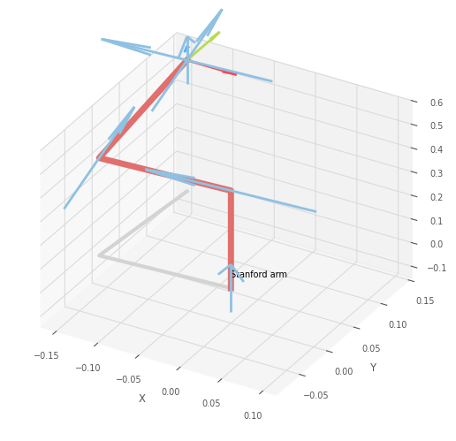
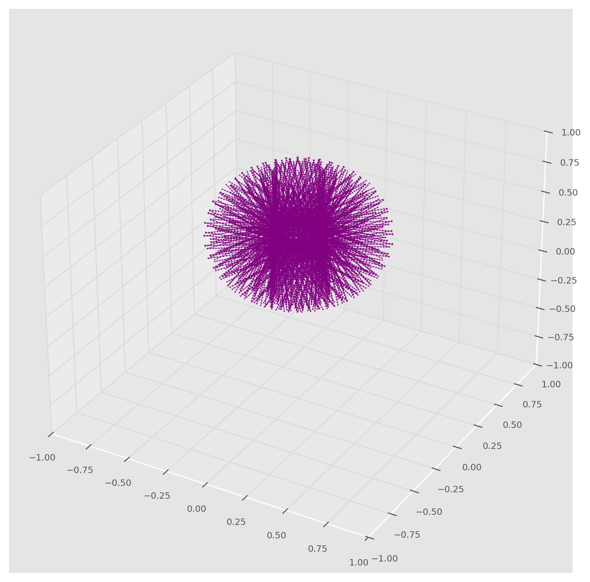
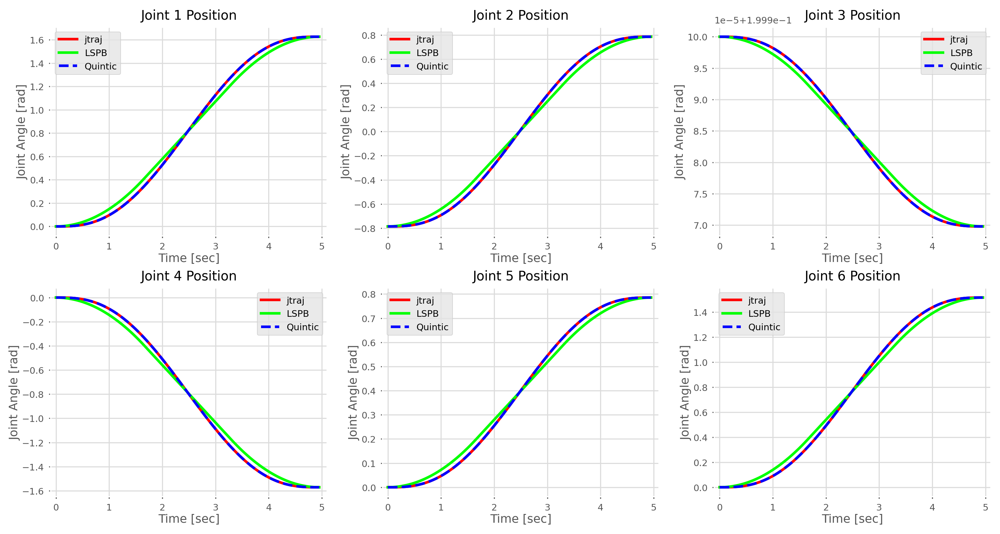
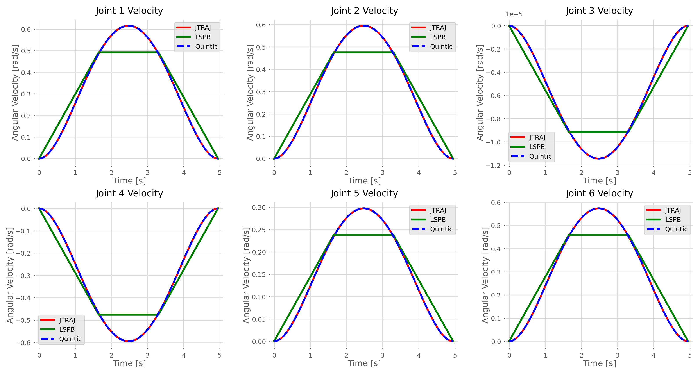
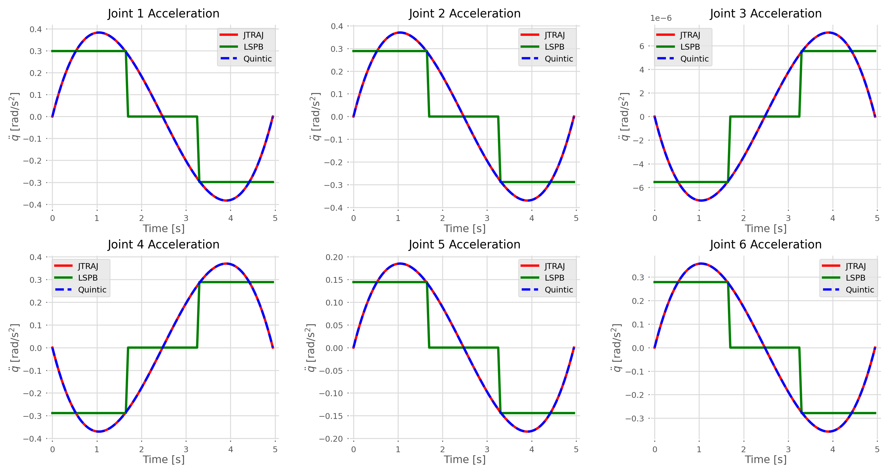

# Lab 2 — Forward and Inverse Kinematics, Workspace Analysis, and Trajectory Planning (Stanford Arm)


> **Course:** Robot Motion Planning and Control — Faculty of Control Systems and Robotics, ITMO University <br>
> **Author:** Umer Ahmed Baig Mughal — MSc Robotics and Artificial Intelligence <br>
> **Topic:** Forward Kinematics · Workspace Construction · Inverse Kinematics (Gauss-Newton) · Trajectory Planning · LSPB · Quintic Polynomial · Joint Position / Velocity / Acceleration Profiles

---

## Table of Contents

1. [Objective](#objective)
2. [Theoretical Background](#theoretical-background)
   - [Problem Formulation: Kinematics and Trajectory Planning](#problem-formulation-kinematics-and-trajectory-planning)
   - [Forward Kinematics and the SE(3) Homogeneous Transform](#forward-kinematics-and-the-se3-homogeneous-transform)
   - [Workspace Construction by Grid Sampling](#workspace-construction-by-grid-sampling)
   - [Inverse Kinematics — Gauss-Newton Method](#inverse-kinematics--gauss-newton-method)
   - [Trajectory Planning Methods](#trajectory-planning-methods)
   - [System Properties](#system-properties)
3. [Robot Model and Kinematic Setup](#robot-model-and-kinematic-setup)
   - [Stanford Arm — DH Parameter Table](#stanford-arm--dh-parameter-table)
   - [Forward Kinematics Result](#forward-kinematics-result)
   - [Inverse Kinematics Setup](#inverse-kinematics-setup)
   - [Three Trajectory Planning Methods](#three-trajectory-planning-methods)
4. [System Parameters](#system-parameters)
   - [Dynamic Model Parameters](#dynamic-model-parameters)
   - [Workspace Sampling Parameters](#workspace-sampling-parameters)
   - [Trajectory Parameters](#trajectory-parameters)
5. [Implementation](#implementation)
   - [File Structure](#file-structure)
   - [Function Reference](#function-reference)
   - [Algorithm Walkthrough](#algorithm-walkthrough)
6. [How to Run](#how-to-run)
7. [Results](#results)
8. [Analysis and Conclusions](#analysis-and-conclusions)
9. [Dependencies](#dependencies)
10. [Notes and Limitations](#notes-and-limitations)
11. [Author](#author)
12. [License](#license)

---

## Objective

This lab extends the Lab 1 dynamic model of the Stanford Arm into a complete **kinematic analysis and trajectory planning study**. Starting from the parameterised 6-DOF RRPRRR model, the lab solves the forward kinematics to determine end-effector pose, constructs the full reachable workspace by grid sampling, solves the inverse kinematics problem numerically using the Gauss-Newton method, and then plans and compares three distinct trajectory types — `jtraj` (joint-space quintic), LSPB (trapezoidal velocity profile), and `mtraj/quintic` (multi-axis quintic) — visualising the resulting joint position, velocity, and acceleration profiles for all six joints.

The key learning outcomes are:

- Loading the Stanford Arm from the Robotics Toolbox and applying the complete dynamic parameter specification from Lab 1 — establishing continuity of the robot model across the laboratory series.
- Solving the **forward kinematics problem** using `robot.fkine()`, interpreting the resulting SE(3) homogeneous transformation matrix as a combination of a 3×3 rotation submatrix (end-effector orientation) and a 3×1 translation vector (end-effector Cartesian position in the base frame).
- Constructing the **reachable workspace** of the manipulator by systematically sweeping the first three joint variables across their full limits in a triple nested loop, computing forward kinematics at each of 27,000 joint-space grid points, and plotting the resulting 3D point cloud to reveal the volume accessible to the end-effector.
- Selecting a **target point within the verified workspace** and solving the **inverse kinematics problem** using `robot.ikine_GN()` — the iterative Gauss-Newton method — which minimises the SE(3) pose error between the current and desired end-effector frame through repeated Jacobian pseudoinverse updates.
- Understanding the use of `spatialmath.base.transl()` to construct a pure-translation SE(3) target matrix for position-only IK, where only Cartesian position is constrained and end-effector orientation is left unconstrained.
- Implementing and comparing **three trajectory planning methods** between the initial and IK-solved final joint configurations: (1) `rtb.jtraj()` — joint-space quintic polynomial with zero boundary velocities and accelerations; (2) `rtb.mtraj(rtb.trapezoidal, ...)` — LSPB with constant-velocity middle segment and parabolic blend phases; (3) `rtb.mtraj(rtb.quintic, ...)` — per-joint quintic polynomial via the multi-axis trajectory wrapper.
- Producing and interpreting **position, velocity, and acceleration time-history plots** for all six joints under each of the three methods — identifying the characteristic signatures of each trajectory type and understanding the trade-offs between profile smoothness, computational simplicity, and actuator stress.

The lab is implemented as a single Jupyter notebook (`Stanford_Arm_Kinematics_Trajectory.ipynb`) running on Python 3.11, producing a robot configuration plot, a 3D workspace visualisation, an IK solution configuration plot, and three multi-panel trajectory figures.

---

## Theoretical Background

### Problem Formulation: Kinematics and Trajectory Planning

Robotic kinematics concerns the geometric relationship between joint space and Cartesian task space — without regard to forces or dynamics. This lab addresses three interconnected kinematic problems in sequence:

```
JOINT SPACE  ──────FK──────►  TASK SPACE
     q             fkine()       T ∈ SE(3)
                                (position + orientation)

TASK SPACE  ──────IK──────►  JOINT SPACE
     T             ikine_GN()    q ∈ ℝ⁶

JOINT SPACE  ────Trajectory──►  JOINT SPACE TIME-SERIES
   q_start       jtraj / LSPB       q(t), q̇(t), q̈(t)
                 / mtraj(quintic)
```

Forward kinematics has a unique closed-form solution. Inverse kinematics is in general a nonlinear problem with multiple solutions, no solution, or infinitely many solutions — requiring either geometric analysis or iterative numerical methods. Trajectory planning connects two joint-space configurations through a smooth time-parameterised path, subject to boundary conditions on position, velocity, and acceleration.

### Forward Kinematics and the SE(3) Homogeneous Transform

For a serial $n$-DOF manipulator with DH parameters, the forward kinematics computes the pose of the end-effector frame $\{n\}$ relative to the base frame $\{0\}$ as a product of successive joint transforms:

```
T₀ₙ = T₀₁ · T₁₂ · T₂₃ · T₃₄ · T₄₅ · T₅₆

where each Tⱼ₋₁,ⱼ = Rz(θⱼ) · Tz(dⱼ) · Tx(aⱼ) · Rx(αⱼ)
```

The result is an element of SE(3) — the Special Euclidean group in 3D — represented as a 4×4 homogeneous matrix:

```
T = | R   p |    R ∈ SO(3): 3×3 rotation matrix (end-effector orientation)
    | 0   1 |    p ∈ ℝ³:    translation vector   (end-effector position)
```

The translation sub-vector $p = [p_x, p_y, p_z]^\top$ directly gives the Cartesian coordinates of the end-effector origin in the base frame. This is the value used to identify workspace points and to select the IK target.

### Workspace Construction by Grid Sampling

The **reachable workspace** of a manipulator is the set of all Cartesian positions the end-effector can reach for at least one joint configuration within the joint limits. A practical approach for a 6-DOF arm is to vary only the first three (position-determining) joints across their limits and compute FK at each grid point:

```python
# Sweep J1, J2, J3 across their full joint limits
for q1 in linspace(qlim₁_low, qlim₁_high, n):      # n points
    for q2 in linspace(qlim₂_low, qlim₂_high, n):
        for q3 in linspace(qlim₃_low, qlim₃_high, n):
            T = fkine([q1, q2, q3, 0, 0, 0])
            workspace_point = T.t    # extract (x, y, z)
```

Wrist joints (J4, J5, J6) are fixed at zero because they form a spherical wrist — they control orientation but do not translate the end-effector position. Total sample count: $n^3 = 30^3 = 27\,000$ points. The resulting 3D point cloud visualises the reachable volume of the arm.

### Inverse Kinematics — Gauss-Newton Method

`robot.ikine_GN()` implements the **Gauss-Newton iterative IK solver**, which formulates the inverse kinematics as a nonlinear least-squares minimisation problem. Given a desired end-effector pose $T_d \in SE(3)$, the algorithm iteratively refines the joint configuration $q$ to minimise the pose error:

```
Pose error:      e(q) = vex(T_d · fkine(q)⁻¹)    (6-vector in se(3))

Update rule:     Δq = (Jᵀ J + λI)⁻¹ Jᵀ e          (Gauss-Newton step)

Update:          q ← q + Δq

Iterate until:   ‖e(q)‖ < tolerance
```

Where $J$ is the manipulator Jacobian evaluated at the current estimate. The Gauss-Newton method converges quadratically near the solution and is numerically efficient for well-conditioned problems.

The target SE(3) matrix is constructed using `spatialmath.base.transl(p)` — a function that builds a pure translation homogeneous matrix with identity rotation:

```
sb.transl([x, y, z]) =   | I₃  [x,y,z]ᵀ |
                         | 0      1     |
```

This constrains only the Cartesian position of the end-effector, leaving its orientation free — simplifying the IK problem to a pure position problem.

### Trajectory Planning Methods

All three methods plan a trajectory from `q_start` to `q_end` over a 5-second interval with 100 sample points.

**Method 1 — `jtraj` (Joint-space quintic polynomial):**
```
q(t) = a₀ + a₁t + a₂t² + a₃t³ + a₄t⁴ + a₅t⁵

Boundary conditions:
    q(0) = q_start,  q̇(0) = 0,  q̈(0) = 0
    q(T) = q_end,    q̇(T) = 0,  q̈(T) = 0

Profile properties:
    Position:     smooth, continuous
    Velocity:     smooth, continuous — zero at endpoints
    Acceleration: smooth, continuous — zero at endpoints
    Jerk:         continuous
```

**Method 2 — `mtraj(trapezoidal)` — LSPB (Linear Segment with Parabolic Blends):**
```
Profile structure:
    [0, t_b]:        parabolic blend — constant acceleration (ramp up)
    [t_b, T-t_b]:    linear segment — constant velocity (cruise)
    [T-t_b, T]:      parabolic blend — constant deceleration (ramp down)

Profile properties:
    Position:      continuous
    Velocity:      trapezoidal shape — continuous
    Acceleration:  piecewise constant — DISCONTINUOUS at blend boundaries
    Jerk:          impulsive at t_b and T-t_b (Dirac delta)
```

**Method 3 — `mtraj(quintic)` (Per-joint quintic via multi-axis wrapper):**
```
Same polynomial order as jtraj (degree 5), applied per-joint scalar
via rtb.mtraj() which maps rtb.quintic() over each joint independently.

Boundary conditions: same as jtraj — zero velocity and acceleration at endpoints
Profile properties:  equivalent smoothness to jtraj
```

| Property | jtraj | LSPB | mtraj/quintic |
|----------|:-----:|:----:|:-------------:|
| Polynomial order | 5th | ~2nd (piecewise) | 5th |
| Velocity at endpoints | 0 | 0 | 0 |
| Acceleration at endpoints | 0 | 0 | 0 |
| Acceleration continuity | ✅ Continuous | ❌ Discontinuous | ✅ Continuous |
| Jerk continuity | ✅ | ❌ | ✅ |
| Implementation | Joint vector | Per-joint scalar | Per-joint scalar |
| Computational cost | Low | Very low | Low |

### System Properties

| Property | Value | Notes |
|----------|-------|-------|
| Robot | Stanford Arm (RRPRRR) | Same model as Lab 1 |
| DH convention | Standard | `rtb.models.DH.Stanford()` |
| FK method | `robot.fkine()` | Exact closed-form product of DH transforms |
| Workspace samples | 27,000 | 30³ grid over J1, J2, J3 joint ranges |
| IK method | Gauss-Newton | `robot.ikine_GN()` |
| IK target type | Position only | `sb.transl()` — identity rotation |
| Trajectory methods | 3 | jtraj, LSPB, mtraj/quintic |
| Trajectory duration | 5 s | `t_stop = 5` |
| Trajectory points | 100 | `N = 100`, step = 0.05 s |
| Plot resolution | 3000×1500 px | `figsize=(10,5)`, dpi=300 |

---

## Robot Model and Kinematic Setup

### Stanford Arm — DH Parameter Table

The model is loaded identically to Lab 1: `robot = rtb.models.DH.Stanford()`. All six dynamic parameters (masses, CoM, inertia tensors, Jm, B, Tc, G, qlim) are assigned identically to Lab 1 before any kinematic analysis is performed.

| Joint | Type | θⱼ | dⱼ (m) | aⱼ (m) | αⱼ | q⁻ | q⁺ |
|:-----:|:----:|:--:|:-------:|:-------:|:--:|:--:|:--:|
| 1 | Revolute | q1 | 0.412 | 0 | −90° | −π rad | +π rad |
| 2 | Revolute | q2 | 0.154 | 0 | +90° | −π rad | +π rad |
| 3 | **Prismatic** | −90° | **q3** | 0.0203 | 0° | 0 m | 0.5 m |
| 4 | Revolute | q4 | 0 | 0 | −90° | −π rad | +π rad |
| 5 | Revolute | q5 | 0 | 0 | +90° | −90° | +90° |
| 6 | Revolute | q6 | 0 | 0 | 0° | −π rad | +π rad |

### Forward Kinematics Result

Applied to the initial configuration `q_start = [0, -π/4, 0.2, 0, 0, 0]`:

```python
T_start = robot.fkine(q_start)
```

**Resulting SE(3) homogeneous transformation matrix:**

```
T_start =  | R          | p          |
           |------------|------------|
           |  0      -1   0          |  -0.1414  |
           |  0.7071  0   0.7071     |   0.1337  |
           | -0.7071  0   0.7071     |   0.5534  |
           |  0       0   0          |   1       |
```

**Numerical values (printed output):**
```
 0       0.7071  -0.7071  | -0.1414
-1       0       0        |  0.1337
 0       0.7071   0.7071  |  0.5534
 0       0       0        |  1
```

**Interpretation:**

| Component | Value | Meaning |
|-----------|-------|---------|
| Translation $p_x$ | −0.1414 m | End-effector x-position in base frame |
| Translation $p_y$ | +0.1337 m | End-effector y-position in base frame |
| Translation $p_z$ | +0.5534 m | End-effector z-position (height above base) |
| Rotation (col 1) | [0, −1, 0]ᵀ | EE x-axis points in −y direction of base |
| Rotation (col 2) | [0.707, 0, 0.707]ᵀ | EE y-axis at 45° between base x and z |
| Rotation (col 3) | [−0.707, 0, 0.707]ᵀ | EE z-axis (approach) at 45° |

The translation vector $p = [-0.1414,\; 0.1337,\; 0.5534]$ is directly used as the IK target in the next step, providing a closed-loop kinematic verification: the arm's IK must recover a configuration that places the end-effector at the exact position produced by its own FK.

### Initial Configuration


### Inverse Kinematics Setup

The IK target is constructed as a **pure translation** SE(3) matrix — constraining only the Cartesian position of the end-effector and leaving its orientation unconstrained:

```python
point = [-0.1414, 0.1337, 0.5534]   # = T_start.t — FK translation vector
T_end = sb.transl(point)             # pure translation matrix (identity rotation)
q_end = robot.ikine_GN(T_end).q     # Gauss-Newton IK solution
```

`sb.transl(point)` produces:
```
T_end = | 1  0  0  -0.1414 |
        | 0  1  0   0.1337 |
        | 0  0  1   0.5534 |
        | 0  0  0   1      |
```

The Gauss-Newton solver `ikine_GN()` iterates from the default zero configuration, applying Jacobian pseudoinverse updates until the position error falls below tolerance. The returned `q_end` is the joint configuration at which the IK converges.

### IK Solution Configuration



### Three Trajectory Planning Methods

```python
N      = 100
t_stop = 5          # seconds
time   = np.arange(0, 5, 0.05)   # 100 points, step = 0.05 s

# Method 1 — Joint-space quintic polynomial
tr_jtraj = rtb.jtraj(q_start, q_end, time)

# Method 2 — LSPB (trapezoidal velocity profile)
tr_trap  = rtb.mtraj(rtb.trapezoidal, q_start, q_end, time)

# Method 3 — Per-joint quintic via mtraj wrapper
tr_quin  = rtb.mtraj(rtb.quintic,    q_start, q_end, time)
```

All three trajectory objects expose `.q` (positions), `.qd` (velocities), `.qdd` (accelerations), each of shape `(100, 6)`.

---

## System Parameters

### Dynamic Model Parameters

Identical to Lab 1. Full parameter tables are reproduced below for completeness.

**Link masses and centres of mass:**

| Link | Role | Mass (kg) | CoM [x, y, z] (m) |
|:----:|:----:|:---------:|:-----------------:|
| 0 | Base | 9.29 | [0, 0, 0.10] |
| 1 | Shoulder | 5.01 | [0, −0.02, 0.12] |
| 2 | Elbow (prismatic) | 4.25 | [0, 0, 0.25] |
| 3 | Wrist 1 | 1.08 | [0, 0.01, 0.02] |
| 4 | Wrist 2 | 0.63 | [0, 0, 0.01] |
| 5 | End-effector | 0.51 | [0, 0, 0.03] |

**Actuator parameters:**

| Link | Jm (kg·m²) | B (N·m·s/rad) | Tc⁺ (N·m) | Tc⁻ (N·m) | Gear Ratio G |
|:----:|:----------:|:-------------:|:---------:|:---------:|:------------:|
| 0 | 2.0×10⁻⁴ | 0.0100 | +0.050 | −0.060 | 120 |
| 1 | 2.0×10⁻⁴ | 0.0080 | +0.040 | −0.050 | 100 |
| 2 | 1.0×10⁻⁴ | 0.0050 | +0.020 | −0.030 | 80 |
| 3 | 5.0×10⁻⁵ | 0.0010 | +0.010 | −0.015 | 50 |
| 4 | 5.0×10⁻⁵ | 0.0010 | +0.010 | −0.015 | 50 |
| 5 | 3.0×10⁻⁵ | 0.0005 | +0.005 | −0.010 | 30 |

### Workspace Sampling Parameters

| Parameter | Value | Description |
|-----------|-------|-------------|
| `n` | 30 | Samples per joint axis |
| Total points | 27,000 | `n³ = 30³` |
| Joints swept | J1, J2, J3 | Position-determining joints only |
| J1 range | [−π, +π] rad | Full revolute limits |
| J2 range | [−π, +π] rad | Full revolute limits |
| J3 range | [0, 0.5] m | Full prismatic limits |
| Wrist joints (J4,J5,J6) | Fixed at 0 | Orientation-only joints |
| Workspace bounds displayed | [−1, 1] m | All three axes |
| Figure resolution | 2400×2400 px | `figsize=(8,8)`, dpi=300 |
| Plot style | Line + scatter (purple) | `linewidth=0.15`, `s=0.5` |

### Trajectory Parameters

| Parameter | Value | Description |
|-----------|-------|-------------|
| `q_start` | [0, −π/4, 0.2, 0, 0, 0] | Initial joint configuration |
| `q_end` | `robot.ikine_GN(T_end).q` | IK-solved final configuration |
| IK target | [−0.1414, 0.1337, 0.5534] m | FK translation of `q_start` |
| `N` | 100 | Trajectory points |
| `t_stop` | 5 s | Duration |
| Time step | 0.05 s | `t_stop / N` |
| Method 1 | `rtb.jtraj()` | Joint-space quintic |
| Method 2 | `rtb.mtraj(rtb.trapezoidal, ...)` | LSPB |
| Method 3 | `rtb.mtraj(rtb.quintic, ...)` | Per-joint quintic |

---

## Implementation

### File Structure

```
Lab_2/
├── Readme.md
├── src/
│   └── Stanford_Arm_Kinematics_Trajectory.ipynb    # Complete lab — FK, workspace, IK, trajectory
└── results/
    ├── Config_Start.png             # 3D visualisation of q_start configuration
    ├── Config_End.png               # 3D visualisation of IK-solved q_end configuration
    ├── Workspace.png                # 3D workspace point cloud — 27,000 FK evaluations
    ├── Joint_Positions.png          # 2×3 position plots — all 3 methods
    ├── Joint_Velocities.png         # 2×3 velocity plots — all 3 methods
    └── Joint_Accelerations.png      # 2×3 acceleration plots — all 3 methods
```

**Notebook and purpose:**

| File | Type | Purpose |
|------|------|---------|
| `Stanford_Arm_Kinematics_Trajectory.ipynb` | Jupyter Notebook | Complete implementation — model setup, FK, workspace, IK, 3-method trajectory, 3 plot figures |

### Function Reference

#### `robot.fkine(q)` — forward kinematics

Computes the SE(3) end-effector pose for a given joint configuration by chaining the six DH homogeneous transforms. Returns an `SE3` object with `.t` (translation vector) and `.R` (rotation matrix) attributes.

```python
T = robot.fkine(q_start)   # SE3 object
print(T)                    # prints 4×4 homogeneous matrix
p = T.t                     # translation vector [x, y, z] in metres
R = T.R                     # 3×3 rotation matrix
```

| Argument | Type | Description |
|----------|------|-------------|
| `q` | `list` or `ndarray` shape (6,) | Joint configuration vector |

**Returns:** `SE3` object — 4×4 homogeneous transformation matrix.

---

#### `sb.transl(t)` — translation SE(3) matrix constructor

Constructs a 4×4 homogeneous transformation matrix representing a pure Cartesian translation with identity rotation. Used to create position-only IK targets.

```python
import spatialmath.base as sb
T_target = sb.transl([-0.1414, 0.1337, 0.5534])
# Result: 4×4 numpy array with I₃ in top-left and [x,y,z]ᵀ in top-right
```

| Argument | Type | Description |
|----------|------|-------------|
| `t` | `list[3]` or `ndarray` shape (3,) | [x, y, z] translation vector in metres |

**Returns:** `ndarray` of shape `(4, 4)` — homogeneous translation matrix.

---

#### `robot.ikine_GN(T)` — Gauss-Newton inverse kinematics

Iterative numerical IK solver based on the Gauss-Newton method. Minimises the SE(3) pose error between the desired transform `T` and `robot.fkine(q)` through repeated Jacobian pseudoinverse updates.

```python
result = robot.ikine_GN(T_end)
q_end  = result.q      # solved joint configuration (6,)
```

| Argument | Type | Description |
|----------|------|-------------|
| `T` | `SE3` or `ndarray` (4,4) | Desired end-effector pose — pure translation or full SE(3) |

**Returns:** IK solution object with attribute `.q` — joint configuration `ndarray` of shape `(6,)`.

---

#### Workspace construction loop

Sweeps J1, J2, J3 across their full joint limits in a triple nested loop, computing FK at each grid point and storing the end-effector translation in a pre-allocated array.

```python
n    = 30
move = [np.linspace(robot.links[i].qlim[0], robot.links[i].qlim[1], n) for i in range(3)]
pose = np.zeros([3, n**3])    # (3, 27000) — stores (x,y,z) per point
i    = 0
for q1 in move[0]:
    for q2 in move[1]:
        for q3 in move[2]:
            Tt = robot.fkine([q1, q2, q3, 0, 0, 0])
            for j in range(3):
                pose[j][i] = Tt.t[j]
            i += 1
```

**Output:** `pose` array of shape `(3, 27000)` — one (x,y,z) column per sampled configuration.

---

#### `rtb.jtraj(q_start, q_end, t)` — joint-space quintic trajectory

Generates a 5th-order polynomial trajectory with zero velocity and acceleration at both endpoints. See Lab 1 Function Reference for full documentation.

```python
tr_jtraj = rtb.jtraj(q_start, q_end, time)   # tr_jtraj.q, .qd, .qdd — each (100, 6)
```

---

#### `rtb.mtraj(func, q_start, q_end, t)` — multi-axis trajectory wrapper

Applies a scalar trajectory function `func` independently to each joint, mapping the scalar boundary conditions `[q_start[i], q_end[i]]` for each joint index `i`. Produces a multi-axis trajectory by stacking the per-joint results.

```python
# LSPB (trapezoidal velocity profile)
tr_trap = rtb.mtraj(rtb.trapezoidal, q_start, q_end, time)

# Per-joint quintic polynomial
tr_quin = rtb.mtraj(rtb.quintic, q_start, q_end, time)
```

| Argument | Type | Description |
|----------|------|-------------|
| `func` | callable | Scalar trajectory generator — `rtb.trapezoidal` or `rtb.quintic` |
| `q_start` | `list` shape (6,) | Start joint configuration |
| `q_end` | `list` shape (6,) | End joint configuration |
| `t` | `ndarray` shape (N,) | Time vector |

**Returns:** Trajectory object with `.q`, `.qd`, `.qdd`, each of shape `(N, 6)`.

---

### Algorithm Walkthrough

**Complete pipeline (`Stanford_Arm_Kinematics_Trajectory.ipynb`):**

```
1. Library imports:
       from math import pi
       import numpy as np
       import roboticstoolbox as rtb
       import matplotlib.pyplot as plt
       import spatialmath.base as sb            ← new in Lab 2

2. Robot model + dynamic parameters (Tasks 1–2):
       robot = rtb.models.DH.Stanford()
       [assign m, r, I, Jm, B, Tc, G, qlim — identical to Lab 1]

3. Initial configuration and visualisation (Task 3):
       q_start = [0, -π/4, 0.2, 0, 0, 0]
       robot.plot(q_start)                       → Config_Start.png

4. Forward kinematics (Task 4):
       T_start = robot.fkine(q_start)            → SE3 4×4 matrix
       print(T_start)
       → Translation: p = [-0.1414, 0.1337, 0.5534] m
       → Rotation: EE oriented with 45° shoulder offset

5. Workspace construction (Task 5):
       n = 30  →  30³ = 27,000 FK evaluations
       Sweep J1 ∈ [-π, π], J2 ∈ [-π, π], J3 ∈ [0, 0.5]
       J4 = J5 = J6 = 0  (wrist fixed)
       Store Tt.t[0..2] → pose array (3, 27000)
       Plot 3D scatter + line in purple, axis [-1,1]³
       → Workspace.png  (2400×2400 px)

6. Inverse kinematics (Task 6):
       point  = T_start.t = [-0.1414, 0.1337, 0.5534]
       T_end  = sb.transl(point)                 → 4×4 pure translation matrix
       q_end  = robot.ikine_GN(T_end).q          → Gauss-Newton IK solution
       robot.plot(q_end)                          → Config_End.png

7. Trajectory planning — 3 methods (Task 7):
       N = 100,  t_stop = 5 s,  time = arange(0, 5, 0.05)
       tr_jtraj = rtb.jtraj(q_start, q_end, time)            # quintic, joint-space
       tr_trap  = rtb.mtraj(rtb.trapezoidal, q_start, q_end, time)  # LSPB
       tr_quin  = rtb.mtraj(rtb.quintic, q_start, q_end, time)      # per-joint quintic

8. Position plots (Task 8 — Figure 1):
       figsize=(10,5), dpi=300  →  3000×1500 px
       2×3 subplots, joint 1–6
       jtraj (red solid), LSPB (green solid), Quintic (blue dashed)
       Y: "Joint Angle [rad]",  X: "Time [sec]"
       → Joint_Positions.png

9. Velocity plots (Task 8 — Figure 2):
       Same layout and colour scheme
       Y: "Angular Velocity [rad/s]",  X: "Time [s]"
       → Joint_Velocities.png

10. Acceleration plots (Task 8 — Figure 3):
       Same layout and colour scheme
       Y: "$\ddot{q}$ [rad/s²]"  (LaTeX label),  X: "Time [s]"
       LSPB: visible piecewise-constant step behaviour
       jtraj / quintic: smooth continuous curves
       → Joint_Accelerations.png
```

---

## How to Run

### Prerequisites

This lab runs as a local Jupyter notebook. Python 3.8+ and Jupyter are required. The `spatialmath-python` package (bundled with `roboticstoolbox-python`) provides the `spatialmath.base` module.

### Install Dependencies

```bash
pip install roboticstoolbox-python numpy matplotlib
```

### Run the Notebook

```bash
# Clone the repository
git clone https://github.com/umerahmedbaig7/Robot-Motion-Planning-and-Control.git
cd Robot-Motion-Planning-and-Control/Lab_2

# Launch Jupyter
jupyter notebook src/Stanford_Arm_Kinematics_Trajectory.ipynb
```

Execute all cells sequentially (**Cell → Run All**) or cell-by-cell for step-by-step inspection. Expected execution time:

| Section | Estimated Time |
|---------|----------------|
| Robot model + parameter setup | < 1 min |
| Initial configuration plot | < 1 min |
| Forward kinematics computation and print | < 1 min |
| Workspace construction (27,000 FK evaluations) | ~2–5 min |
| Workspace 3D plot (dpi=300) | ~1 min |
| Inverse kinematics (Gauss-Newton) | < 1 min |
| Trajectory planning (3 methods) | < 1 min |
| Position / velocity / acceleration plots (3 × dpi=300) | ~2–3 min |
| **Total** | **~8–13 min** |

> ⚠️ The workspace construction loop (Cell 29) performs 27,000 `robot.fkine()` calls in a triple nested Python loop and is the most time-consuming step. Reducing `n` from 30 to 15 decreases evaluation count to 3,375 and halves runtime if needed.

### Modifying the Initial Configuration

```python
q_start = [0, -pi/4, 0.2, 0, 0, 0]    # [J1 rad, J2 rad, J3 m, J4 rad, J5 rad, J6 rad]
# Respect joint limits: revolute ±π rad, prismatic [0, 0.5] m
```

### Modifying the IK Target

To set an arbitrary Cartesian target rather than the FK result of `q_start`:

```python
# Choose any point visually confirmed to be inside the workspace point cloud
point = [x, y, z]
T_end = sb.transl(point)
q_end = robot.ikine_GN(T_end).q
```

### Modifying the Workspace Resolution

```python
n = 30     # increase for denser cloud (n³ evaluations), decrease for faster computation
```

### Modifying Trajectory Parameters

```python
N      = 100     # number of points
t_stop = 5       # total duration in seconds
time   = np.arange(0, t_stop, t_stop/N)
```

---

## Results

### Workspace Visualisation

The 3D workspace of the Stanford Arm — constructed from 27,000 FK evaluations sweeping J1, J2, and J3 across their full joint limits — reveals the reachable volume of the end-effector position.



### Joint Position Profiles

Position trajectories for all six joints under each of the three planning methods (jtraj, LSPB, Quintic), plotted over 0–5 seconds.



**Key observations:**
- All three methods correctly interpolate from `q_start` to `q_end` with matching start and end values for all joints.
- Position profiles for all three methods are visually smooth — differences between methods are more apparent in the velocity and acceleration plots.
- Joints with zero displacement (where `q_start[i] = q_end[i]`) show flat constant lines across all methods.

### Joint Velocity Profiles

Velocity time histories reveal the characteristic signature of each trajectory method.



**Key observations:**
- **jtraj (red):** Smooth bell-shaped velocity profile — zero at start and end, peak in the middle. Differentiable everywhere.
- **LSPB (green):** Trapezoidal velocity profile — linear ramp-up, flat constant-velocity cruise, linear ramp-down. The constant-velocity segment is clearly visible for joints with large displacements.
- **Quintic (blue dashed):** Smooth profile matching jtraj in boundary conditions, slightly different shape mid-trajectory due to the per-joint independent scalar treatment.

### Joint Acceleration Profiles

Acceleration profiles most clearly distinguish the three methods.



**Key observations:**
- **jtraj (red) and Quintic (blue):** Smooth continuous acceleration curves — zero at both endpoints, positive peak in the first half of motion, negative peak in the second half. Jerk is bounded and continuous.
- **LSPB (green):** Piecewise-constant acceleration — sharp step transitions at the blend boundaries ($t = t_b$ and $t = T - t_b$). These discontinuities represent impulsive jerk events, which impose instantaneous torque impulses on the joints in a real actuator system.

---

## Analysis and Conclusions

### Forward Kinematics Verification

The forward kinematics computation for `q_start = [0, −π/4, 0.2, 0, 0, 0]` produces the end-effector position $p = [-0.1414, 0.1337, 0.5534]$ m. Using this same point as the IK target and solving with the Gauss-Newton method provides a direct closed-loop kinematic verification: if the IK converges to a configuration whose FK matches the target position within tolerance, the kinematic model is self-consistent. The robot configuration visualised after IK confirms that the arm reaches the intended point.

### Workspace Analysis

The 3D workspace point cloud reveals the characteristic **toroidal shell** geometry of the Stanford Arm's reachable volume. The central void arises because the minimum extension of the prismatic joint (Joint 3 lower limit = 0 m) prevents the end-effector from reaching the immediate vicinity of the base origin. The outer boundary is defined by the maximum prismatic extension (0.5 m) combined with the full revolute reach of J1 and J2. The workspace is approximately symmetric about the vertical (z) axis, reflecting the full ±π range of the base joint J1.

### Trajectory Method Comparison

The three methods produce fundamentally different motion profiles, with clear trade-offs between smoothness and complexity:

**jtraj** produces a smooth quintic polynomial trajectory with zero velocity and acceleration at both endpoints — ideal for smooth starts and stops that minimise shock loads on mechanical joints. Its bell-shaped velocity profile ensures no instantaneous velocity steps at the start or end of the motion.

**LSPB** maximises the time spent at constant velocity — reaching peak velocity faster and maintaining it longer than the quintic methods. This maximises task-space throughput and is preferred in industrial pick-and-place operations where cycle time is critical. The trade-off is the bang-bang acceleration profile: the step changes in acceleration at the blend boundaries impose higher transient joint loads compared to smooth polynomial methods.

**mtraj/quintic** produces profiles with the same endpoint boundary conditions as jtraj. Since it applies the quintic scalar function independently per joint rather than solving the full joint-vector polynomial simultaneously, its mid-trajectory shape can differ slightly from jtraj for multi-joint motions. For practical purposes, the two methods produce near-identical profiles for the trajectory range used in this lab.

**Conclusion:** For the Stanford Arm operating under precision motion requirements — where mechanical stress reduction and smooth actuator loading are priorities — the **quintic polynomial method** (both jtraj and mtraj/quintic) is the optimal choice. The continuous acceleration and bounded jerk profiles minimise peak actuator torque demands and reduce wear on the gearboxes. LSPB remains the preferred choice for time-optimal industrial applications where the discontinuous acceleration is acceptable within the actuator's torque bandwidth.

---

## Dependencies

| Package | Version | Purpose |
|---------|---------|---------|
| `Python` | ≥ 3.8 | Runtime environment |
| `roboticstoolbox-python` | ≥ 1.0 | `robot.fkine()`, `robot.ikine_GN()`, `rtb.jtraj()`, `rtb.mtraj()`, `rtb.trapezoidal`, `rtb.quintic`, `robot.plot()` |
| `spatialmath-python` | ≥ 1.0 | `spatialmath.base.transl()` — constructs pure-translation SE(3) target matrix for IK |
| `numpy` | ≥ 1.21 | `np.linspace()`, `np.zeros()`, `np.arange()`, array indexing |
| `matplotlib` | ≥ 3.4 | 3D workspace scatter plot, 2×3 trajectory subplot figures, dpi=300 output |

Install all dependencies:

```bash
pip install roboticstoolbox-python numpy matplotlib
```

---

## Notes and Limitations

- **IK target is position-only:** The `sb.transl()` target imposes no orientation constraint — the Gauss-Newton solver is free to find any joint configuration that achieves the target Cartesian position, regardless of end-effector orientation. For tasks requiring a specific approach direction, a full SE(3) target with an explicit rotation matrix should be used instead.
- **Workspace resolution is approximate:** The 30³ grid samples 27,000 discrete points from a continuous joint space. The displayed point cloud is a representative approximation of the true reachable workspace — the actual boundary may contain fine structural features not captured at this resolution. Increasing `n` improves fidelity at the cost of longer computation time.
- **Gauss-Newton convergence depends on the initial guess:** `ikine_GN()` initialises from the zero configuration by default. For targets far from the zero configuration or in regions of high kinematic nonlinearity, the solver may converge to a local minimum or fail to converge entirely. Alternative solvers (`ikine_LM`, `ikine_NR`) or a better initial guess may be required in such cases.
- **LSPB acceleration discontinuities are physically real:** The step changes in acceleration produced by the trapezoidal profile represent a genuine physical constraint — real actuators must handle these abrupt torque transitions. In practice, the finite bandwidth of servo controllers smooths these steps slightly, but designing trajectories with continuous acceleration avoids this issue entirely.

---

## Author

**Umer Ahmed Baig Mughal** <br>
Master's in Robotics and Artificial Intelligence <br>
*Specialization: Machine Learning · Computer Vision · Human-Robot Interaction · Autonomous Systems · Robotic Motion Control*

---

## License

This project is intended for **academic and research use**. It was developed as part of the *Robot Motion Planning and Control* course within the MSc Robotics and Artificial Intelligence program at ITMO University. Redistribution, modification, and use in derivative academic work are permitted with appropriate attribution to the original author.

---

*Lab 2 — Robot Motion Planning and Control | MSc Robotics and Artificial Intelligence | ITMO University*

