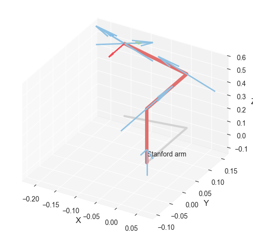
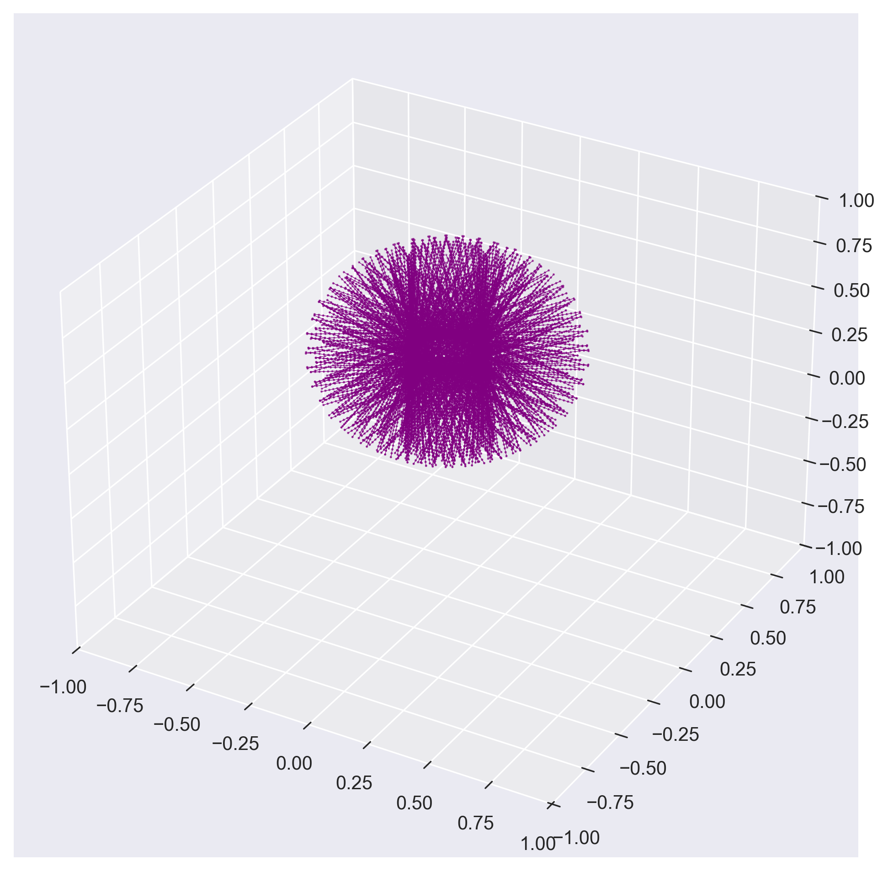
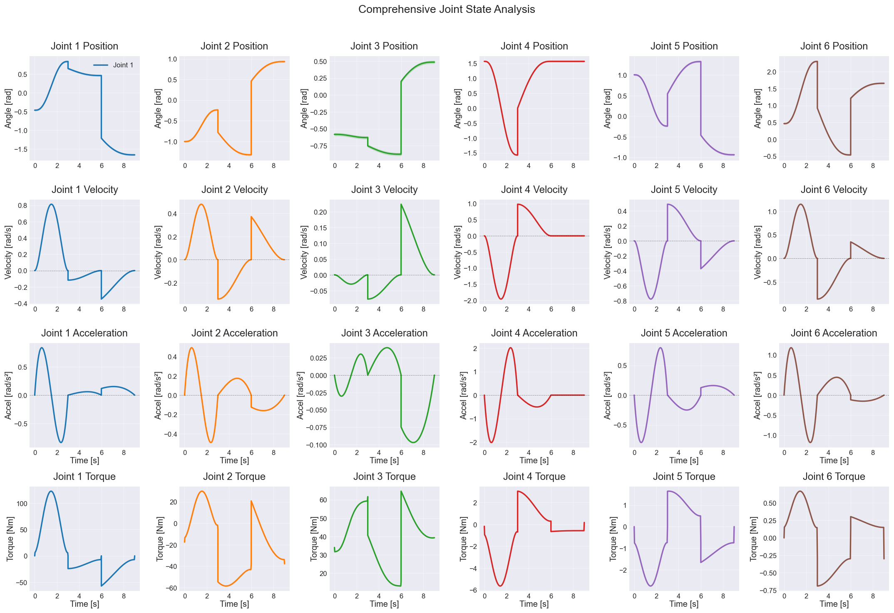
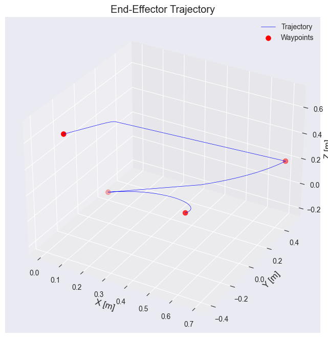
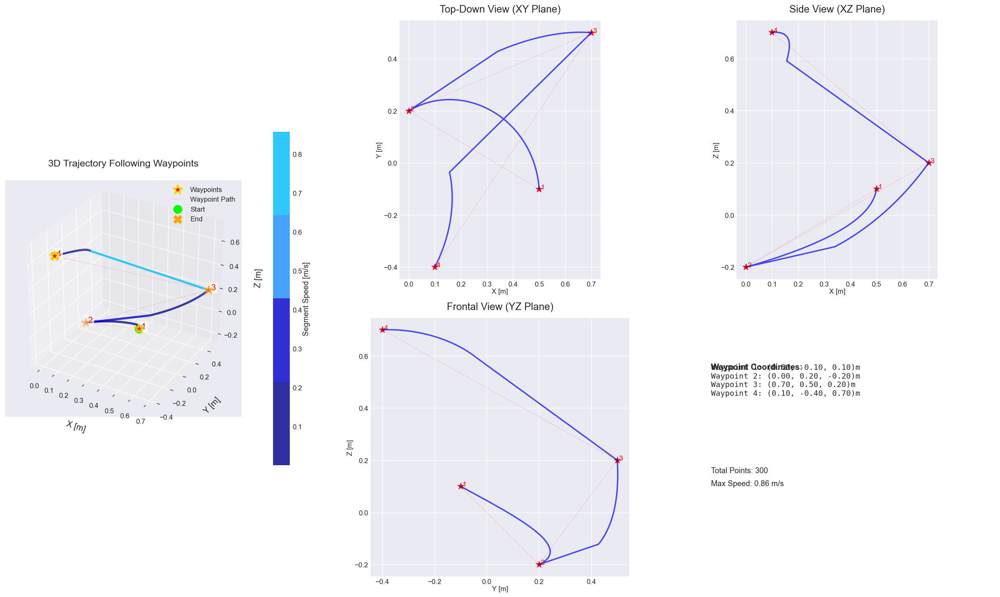

# Lab 3 — Multi-Point Motion Trajectory Planning for the Stanford Manipulator


> **Course:** Robot Motion Planning and Control — Faculty of Control Systems and Robotics, ITMO University <br>
> **Author:** Umer Ahmed Baig Mughal — MSc Robotics and Artificial Intelligence <br>
> **Topic:** Multi-Point Trajectory Planning · Forward Kinematics · Inverse Kinematics (Levenberg-Marquardt) · Cubic Polynomial Interpolation · Joint Torque Estimation · End-Effector Path Visualisation

---

## Table of Contents

1. [Objective](#objective)
2. [Theoretical Background](#theoretical-background)
   - [Problem Formulation: Multi-Waypoint Trajectory Planning](#problem-formulation-multi-waypoint-trajectory-planning)
   - [Forward and Inverse Kinematics Recap](#forward-and-inverse-kinematics-recap)
   - [Levenberg-Marquardt IK Solver](#levenberg-marquardt-ik-solver)
   - [Cubic Polynomial Time Functions and Parameter Calculation](#cubic-polynomial-time-functions-and-parameter-calculation)
   - [Multi-Segment Trajectory Concatenation](#multi-segment-trajectory-concatenation)
   - [System Properties](#system-properties)
3. [Waypoint Design and Kinematic Solution](#waypoint-design-and-kinematic-solution)
   - [Stanford Arm — DH Parameter Table](#stanford-arm--dh-parameter-table)
   - [Forward Kinematics Result](#forward-kinematics-result)
   - [Four Cartesian Waypoints](#four-cartesian-waypoints)
   - [Inverse Kinematics Solutions](#inverse-kinematics-solutions)
   - [Trajectory Segments and Time Functions](#trajectory-segments-and-time-functions)
4. [System Parameters](#system-parameters)
   - [Dynamic Model Parameters](#dynamic-model-parameters)
   - [Waypoint and Trajectory Parameters](#waypoint-and-trajectory-parameters)
5. [Implementation](#implementation)
   - [File Structure](#file-structure)
   - [Function Reference](#function-reference)
   - [Algorithm Walkthrough](#algorithm-walkthrough)
6. [How to Run](#how-to-run)
7. [Results](#results)
8. [Analysis and Conclusions](#analysis-and-conclusions)
9. [Dependencies](#dependencies)
10. [Notes and Limitations](#notes-and-limitations)
11. [Author](#author)
12. [License](#license)

---

## Objective

This lab develops a complete **multi-waypoint trajectory planning pipeline** for the Stanford Arm, bridging task-space goal specification and joint-space execution. Four Cartesian end-effector positions are defined in the workspace, their joint-space representations are computed via Levenberg-Marquardt inverse kinematics, and cubic polynomial time functions are constructed to smoothly interpolate between consecutive waypoints. The resulting joint trajectories are fully analysed through position, velocity, acceleration, and torque profiles across all six joints, and the end-effector path is visualised in three-dimensional space from multiple viewpoints.

The key learning outcomes are:

- Maintaining the full **Stanford Arm dynamic model** from Labs 1–2 as the consistent foundation for this lab, reinforcing the importance of a complete and accurately parameterised robot model across the laboratory series.
- Solving the **forward kinematics** for the initial configuration and using the resulting end-effector pose to confirm workspace reachability, and constructing the full reachable workspace by grid sampling for visual selection of candidate waypoints.
- Selecting **four Cartesian end-effector positions** distributed across the workspace volume and confirmed to lie within the reachable workspace, covering positions at different heights, lateral extents, and depth, to produce a geometrically diverse and mechanically challenging multi-point trajectory.
- Solving the **inverse kinematics problem** for each of the four waypoints using `robot.ikine_LM()` — the Levenberg-Marquardt iterative solver — which combines the advantages of gradient descent and Gauss-Newton methods for robust convergence, and verifying that all four solutions are successful before proceeding to trajectory construction.
- Defining **motion time functions** as cubic polynomial (quintic `jtraj`) segments: constructing separate `rtb.jtraj()` trajectories for each consecutive pair of waypoints over assigned time intervals `[0,3]`, `[3,6]`, `[6,9]` seconds, computing the polynomial coefficients implicitly from the boundary conditions, and concatenating all segments into a continuous time-series.
- Producing a **comprehensive 4×6 joint state analysis figure** covering position, velocity, acceleration, and estimated torque profiles for all six joints over the full 9-second trajectory, with `tab10` colour coding per joint, fill-between uncertainty bands on position, and zero-reference lines on velocity and acceleration plots.
- Estimating **joint torques** along the planned trajectory using `robot.rne()` — the recursive Newton-Euler inverse dynamics solver — demonstrating that the trajectory is dynamically feasible and that the required torque profiles are smooth and free of impulsive spikes.
- Visualising the **Cartesian end-effector path** through two complementary figures: a simple 3D trajectory plot and a professional multi-panel layout featuring a speed-coloured 3D trajectory, three orthogonal 2D projection views (XY, XZ, YZ), and an information panel displaying waypoint coordinates and peak segment speed.

The lab is implemented as a single Jupyter notebook (`Stanford_Arm_Multi_Point_Trajectory.ipynb`) running on Python 3.11, producing five output figures covering workspace visualisation, initial configuration, comprehensive joint states, and two end-effector trajectory views.

---

## Theoretical Background

### Problem Formulation: Multi-Waypoint Trajectory Planning

Multi-waypoint trajectory planning extends the two-point trajectory problem to a sequence of $n$ waypoints $\{q_1, q_2, \ldots, q_n\}$ that the robot must pass through at prescribed times $\{t_1, t_2, \ldots, t_n\}$. The trajectory is decomposed into $n-1$ independent segments, each connecting a consecutive pair of waypoints:

```
Segment k:  from q_k  at time t_k
            to   q_{k+1}  at time t_{k+1}

Full trajectory:  q(t) = { segment_1(t)   for t ∈ [t_1, t_2]
                          { segment_2(t)   for t ∈ [t_2, t_3]
                          { segment_3(t)   for t ∈ [t_3, t_4]
```

For this lab: **4 waypoints** → **3 segments** over **9 seconds total** (`t = [0, 3, 6, 9]` s, each segment 3 seconds).

The complete pipeline proceeds in four stages:

```
Stage 1 — Task-space specification:
    Define 4 Cartesian positions {p_1, p_2, p_3, p_4} ∈ ℝ³

Stage 2 — Joint-space conversion (Inverse Kinematics):
    Solve q_k = IK(p_k)  for k = 1..4  using Levenberg-Marquardt

Stage 3 — Time function construction (Trajectory Planning):
    For each segment k: jtraj(q_k, q_{k+1}, t_segment)  →  q(t), q̇(t), q̈(t)

Stage 4 — Dynamic analysis and visualisation:
    Torques: τ(t) = rne(q(t), q̇(t), q̈(t))
    EE path: p(t) = fkine(q(t)).t
```

### Forward and Inverse Kinematics Recap

Forward kinematics (`robot.fkine(q)`) maps joint configurations to end-effector SE(3) pose — identical to Lab 2. Inverse kinematics solves the reverse: given a desired Cartesian position, find the joint configuration that achieves it. For the four-waypoint problem, IK is solved independently per waypoint:

```
For each waypoint p_k = [x_k, y_k, z_k]:
    T_k  = sb.transl(p_k)          — pure translation SE(3) target (no orientation)
    q_k  = robot.ikine_LM(T_k).q  — Levenberg-Marquardt solution
```

The pure-translation target (`sb.transl()` with identity rotation) makes the IK problem a pure position task — the solver finds any joint configuration that places the end-effector at the target Cartesian point, regardless of orientation. This is appropriate when task-space orientation requirements are not specified.

### Levenberg-Marquardt IK Solver

`robot.ikine_LM()` implements the **Levenberg-Marquardt (LM)** method — a robust iterative nonlinear least-squares solver that interpolates between the Gauss-Newton and gradient descent update rules via a damping parameter $\lambda$:

```
Gauss-Newton step:    Δq_GN = (JᵀJ)⁻¹ Jᵀ e
Gradient descent:     Δq_GD = Jᵀ e
LM update:            Δq    = (JᵀJ + λI)⁻¹ Jᵀ e

Adaptive damping:
    if ‖e‖ decreases → decrease λ  (move toward Gauss-Newton — faster convergence)
    if ‖e‖ increases → increase λ  (move toward gradient descent — more stable)
```

The LM method is more robust than pure Gauss-Newton (`ikine_GN`, used in Lab 2) for targets far from the initial guess or near kinematic singularities, because the damping term $\lambda I$ regularises the Jacobian pseudoinverse and prevents excessively large update steps. The initial configuration `q_start = [0, −π/4, 0.2, 0, 0, 0]` is used as the starting estimate for all four IK solves via the `q0` parameter.

### Cubic Polynomial Time Functions and Parameter Calculation

Each trajectory segment uses `rtb.jtraj()`, which generates a **5th-order (quintic) polynomial** in joint space — commonly referred to as a cubic-polynomial-class motion profile due to its continuous up to jerk. For each joint $i$ and segment $k$, the polynomial is:

```
q_i(t) = a₀ + a₁t + a₂t² + a₃t³ + a₄t⁴ + a₅t⁵

Parameter calculation from boundary conditions:
    q_i(0) = q_start_i,    q̇_i(0) = 0,    q̈_i(0) = 0    ← start conditions
    q_i(T) = q_end_i,      q̇_i(T) = 0,    q̈_i(T) = 0    ← end conditions

Solving the 6×6 linear system yields:
    a₀ = q_start_i
    a₁ = 0
    a₂ = 0
    a₃ =  10(q_end_i − q_start_i) / T³
    a₄ = −15(q_end_i − q_start_i) / T⁴
    a₅ =   6(q_end_i − q_start_i) / T⁵

where T = segment duration = 3 seconds
```

The six coefficients $\{a_0, \ldots, a_5\}$ are the **parameters of the time function** uniquely determined by the boundary conditions. Setting zero velocity and acceleration at both segment endpoints guarantees smooth starts and stops at each waypoint and continuous joining between segments.

### Multi-Segment Trajectory Concatenation

The three segment trajectories are generated independently and then concatenated into a single continuous time-series:

```python
for i in range(3):                                         # 3 segments
    t_segment = np.linspace(t_points[i], t_points[i+1], N)  # 100 pts per segment
    traj = rtb.jtraj(joint_points[i], joint_points[i+1], t_segment)
    q_traj.append(traj.q)       # (100, 6)
    qd_traj.append(traj.qd)     # (100, 6)
    qdd_traj.append(traj.qdd)   # (100, 6)

q_traj   = np.vstack(q_traj)    # (300, 6) — full trajectory
time_traj = np.hstack(time_traj) # (300,)   — time axis 0→9 s
```

Each segment is independently parameterised with zero boundary velocities, so the transition points at $t=3$ s and $t=6$ s have continuous position but potentially **discontinuous velocity** between adjacent segments — a standard property of piecewise-jtraj trajectories when no inter-segment velocity constraints are imposed. The practical effect is visible as velocity spikes at $t=3$ s and $t=6$ s in the velocity profiles.

### System Properties

| Property | Value | Notes |
|----------|-------|-------|
| Robot | Stanford Arm (RRPRRR) | Same model as Labs 1–2 |
| DH convention | Standard | `rtb.models.DH.Stanford()` |
| Waypoints | 4 Cartesian positions | Defined in task-space ℝ³ |
| IK method | Levenberg-Marquardt | `robot.ikine_LM()` — more robust than Lab 2's Gauss-Newton |
| IK target type | Position only | `sb.transl()` — identity rotation |
| Trajectory method | `rtb.jtraj()` per segment | Quintic polynomial |
| Segments | 3 | P1→P2, P2→P3, P3→P4 |
| Time stamps | [0, 3, 6, 9] s | 3 seconds per segment |
| Points per segment | 100 | Step = 0.03 s |
| Total trajectory points | 300 | 3 segments × 100 |
| Torque estimation | `robot.rne()` | Full Newton-Euler inverse dynamics |
| EE path | Recomputed via FK | `robot.fkine(qi).t` per point |
| Platform | Local Jupyter | Python 3.11 |

---

## Waypoint Design and Kinematic Solution

### Stanford Arm — DH Parameter Table

The model is loaded identically to all previous labs and all dynamic parameters are assigned before any kinematic computation.

| Joint | Type | θⱼ | dⱼ (m) | aⱼ (m) | αⱼ | q⁻ | q⁺ |
|:-----:|:----:|:--:|:-------:|:-------:|:--:|:--:|:--:|
| 1 | Revolute | q1 | 0.412 | 0 | −90° | −π rad | +π rad |
| 2 | Revolute | q2 | 0.154 | 0 | +90° | −π rad | +π rad |
| 3 | **Prismatic** | −90° | **q3** | 0.0203 | 0° | 0 m | 0.5 m |
| 4 | Revolute | q4 | 0 | 0 | −90° | −π rad | +π rad |
| 5 | Revolute | q5 | 0 | 0 | +90° | −90° | +90° |
| 6 | Revolute | q6 | 0 | 0 | 0° | −π rad | +π rad |

### Forward Kinematics Result

Applied to `q_start = [0, −π/4, 0.2, 0, 0, 0]`:

```
T_start = robot.fkine(q_start)

 0       0.7071  -0.7071  | -0.1414
-1       0       0        |  0.1337
 0       0.7071   0.7071  |  0.5534
 0       0       0        |  1
```

End-effector Cartesian position: `p = [−0.1414, 0.1337, 0.5534]` m — confirms model initialisation and provides workspace reference for waypoint selection.

### Initial Configuration



### Workspace Visualisation

3D workspace constructed from 27,000 FK evaluations sweeping J1, J2, J3 across their full joint limits — used to visually confirm that all four selected waypoints lie within the reachable volume.



### Four Cartesian Waypoints

Four end-effector positions are selected across different regions of the workspace, providing geometric diversity in direction and height to produce a mechanically varied multi-point trajectory:

| Waypoint | x (m) | y (m) | z (m) | Description |
|:--------:|:-----:|:-----:|:-----:|:-----------:|
| **P1** | 0.5 | −0.1 | 0.1 | Forward-right, low height |
| **P2** | 0.0 | 0.2 | −0.2 | Centred, negative z (below base plane) |
| **P3** | 0.7 | 0.5 | 0.2 | Forward-far, right-lateral, mid-height |
| **P4** | 0.1 | −0.4 | 0.7 | Near-base, right-lateral, high height |

The four points span a volume from `z = −0.2` to `z = 0.7` m and radial extents up to 0.86 m (`‖[0.7, 0.5]‖₂`), exercising the arm's full kinematic range.

### Inverse Kinematics Solutions

IK is solved for each waypoint using the Levenberg-Marquardt method with `q_start` as initial guess:

```python
for p in points:
    T   = sb.transl(p)                 # pure translation SE(3) target
    sol = robot.ikine_LM(T, q0=q_start)  # LM solver
    if sol.success:
        joint_points.append(sol.q)
    else:
        raise RuntimeError(f"IK failed for point {p}")
```

All four IK solves converge successfully. The computed joint configurations are:

| Waypoint | J1 (rad) | J2 (rad) | J3 | J4 (rad) | J5 (rad) | J6 (rad) |
|:--------:|:--------:|:--------:|:--:|:--------:|:--------:|:--------:|
| P1 | −0.4627 | −1.0057 | −0.5826 | +1.5708 | +1.0057 | +0.4627 |
| P2 | +0.8386 | −0.2384 | −0.6298 | −1.5708 | −0.2384 | +2.3030 |
| P3 | +0.4642 | −1.3263 | −0.8758 | +1.5708 | +1.3263 | −0.4642 |
| P4 | −1.6561 | +0.9348 | +0.4848 | +1.5708 | −0.9348 | +1.6561 |

Notable patterns: J4 is consistently ±π/2 (±1.5708 rad) across all four solutions — a characteristic of the Stanford Arm's wrist geometry when solving position-only IK with a pure-translation target. J5 and J1 are anti-symmetric in P1 and P4, indicating a base-flip configuration pair.

### Trajectory Segments and Time Functions

Three `jtraj` segments connect the four waypoints over a 9-second total duration. Each segment uses a quintic polynomial with time-function parameters automatically calculated from the boundary conditions.

| Segment | From | To | Time interval | Duration | Points |
|:-------:|:----:|:--:|:-------------:|:--------:|:------:|
| 1 | P1 | P2 | [0, 3] s | 3 s | 100 |
| 2 | P2 | P3 | [3, 6] s | 3 s | 100 |
| 3 | P3 | P4 | [6, 9] s | 3 s | 100 |

**Time function parameter calculation (per joint, per segment):**

For segment duration $T = 3$ s and joint displacement $\Delta q = q_{end} - q_{start}$, the five non-trivial quintic coefficients are:

```
a₃ =  10·Δq / T³ = 10·Δq / 27
a₄ = −15·Δq / T⁴ = −15·Δq / 81
a₅ =   6·Δq / T⁵ =   6·Δq / 243
```

For example, Joint 1, Segment 1 (P1→P2, $\Delta q = 0.8386 - (-0.4627) = 1.3013$ rad):
```
a₃ =  10 × 1.3013 / 27   =  +0.4820 rad/s³
a₄ = −15 × 1.3013 / 81   =  −0.2409 rad/s⁴
a₅ =   6 × 1.3013 / 243  =  +0.0321 rad/s⁵
```

These coefficients fully define the time function for each joint in each segment, guaranteeing zero velocity and zero acceleration at both the start and end of every segment.

---

## System Parameters

### Dynamic Model Parameters

Identical to Labs 1–2. Full tables are in the Lab 1 README.

**Summary:**

| Link | Mass (kg) | Jm (kg·m²) | B (N·m·s/rad) | Gear Ratio G |
|:----:|:---------:|:----------:|:-------------:|:------------:|
| 0 (Base) | 9.29 | 2.0×10⁻⁴ | 0.0100 | 120 |
| 1 (Shoulder) | 5.01 | 2.0×10⁻⁴ | 0.0080 | 100 |
| 2 (Elbow, P) | 4.25 | 1.0×10⁻⁴ | 0.0050 | 80 |
| 3 (Wrist 1) | 1.08 | 5.0×10⁻⁵ | 0.0010 | 50 |
| 4 (Wrist 2) | 0.63 | 5.0×10⁻⁵ | 0.0010 | 50 |
| 5 (EE) | 0.51 | 3.0×10⁻⁵ | 0.0005 | 30 |

### Waypoint and Trajectory Parameters

| Parameter | Value | Description |
|-----------|-------|-------------|
| Waypoints | P1–P4 | 4 Cartesian positions in ℝ³ |
| IK solver | `robot.ikine_LM()` | Levenberg-Marquardt — `q0=q_start` for all 4 |
| IK target | `sb.transl(p)` | Pure translation, identity rotation |
| `t_points` | [0, 3, 6, 9] s | Time stamps for P1, P2, P3, P4 |
| Segments | 3 | P1→P2, P2→P3, P3→P4 |
| Duration per segment | 3 s | Uniform segment duration |
| `N` per segment | 100 | Points per jtraj segment |
| Total points | 300 | After concatenation |
| Time step | 0.03 s | `3 / 100` |
| Trajectory method | `rtb.jtraj()` | Quintic polynomial per segment |
| Torque computation | `robot.rne()` | Full trajectory `(300, 6)` → torque `(300, 6)` |
| EE path computation | `robot.fkine(qi).t` | FK applied at each of 300 trajectory points |
| Position plot style | `tab10` colormap + `fill_between(±0.02)` | Per-joint colour coding + uncertainty band |
| Velocity/accel style | `axhline(0)` dashed reference | Zero-crossing reference line |
| Figure 1 resolution | 2160×1440 px | `figsize=(18,12)`, dpi=120 |
| Figure 2 resolution | 800×800 px | Simple 3D EE trajectory |
| Figure 3 resolution | 2400×1440 px | Multi-panel `figsize=(20,12)`, dpi=120 |

---

## Implementation

### File Structure

```
Lab_3/
├── Readme.md
├── src/
│   └── Stanford_Arm_Multi_Point_Trajectory.ipynb    # Complete lab — 4-point trajectory planning
└── results/
    ├── Config_Start.png                              # Initial robot configuration q_start
    ├── Workspace.png                                 # 3D workspace — 27,000 FK evaluations
    ├── Joint_States_Comprehensive.png                # 4×6 grid: positions, velocities, accelerations, torques
    ├── EE_Trajectory_Simple.png                      # Simple 3D end-effector path + waypoints
    └── EE_Trajectory_MultiView.png                   # Multi-panel: 3D + XY/XZ/YZ projections + info panel
```

**Notebook and purpose:**

| File | Type | Purpose |
|------|------|---------|
| `Stanford_Arm_Multi_Point_Trajectory.ipynb` | Jupyter Notebook | Complete pipeline — robot model, FK, workspace, 4-point IK (LM), 3-segment jtraj, comprehensive state plots, torque estimation, EE visualisation |

### Function Reference

#### `robot.fkine(q)` — forward kinematics

Identical to Lab 2. Returns SE(3) object. Used here to: (1) verify initial configuration, (2) compute the full Cartesian end-effector path by applying FK to every point in `q_traj`.

```python
T_start   = robot.fkine(q_start)              # initial EE pose
positions = np.array([robot.fkine(qi).t       # EE positions along trajectory
                      for qi in q_traj])       # shape (300, 3)
```

---

#### `robot.ikine_LM(T, q0)` — Levenberg-Marquardt inverse kinematics

Iterative IK solver using the Levenberg-Marquardt algorithm. More robust than Gauss-Newton for targets that are far from the initial guess or near kinematic singularities, due to adaptive damping of the Jacobian pseudoinverse. Returns a solution object; `sol.success` is checked to confirm convergence before appending to `joint_points`.

```python
sol = robot.ikine_LM(T_k, q0=q_start)   # q0 = initial joint guess
if sol.success:
    joint_points.append(sol.q)           # shape (6,)
else:
    raise RuntimeError(...)
```

| Argument | Type | Description |
|----------|------|-------------|
| `T` | `SE3` or `ndarray` (4,4) | Desired EE pose — `sb.transl(p)` for position-only |
| `q0` | `ndarray` shape (6,) | Initial joint configuration for iterative solver |

**Returns:** Solution object with `.q` (joint configuration `ndarray` shape (6,)) and `.success` (bool).

---

#### `rtb.jtraj(q_start, q_end, t)` — quintic polynomial segment

Generates a single quintic trajectory segment between two joint configurations. Called once per segment in the `for i in range(3)` loop. See Lab 1 Function Reference for full mathematical documentation.

```python
traj = rtb.jtraj(joint_points[i], joint_points[i+1], t_segment)
# traj.q   shape (100, 6) — joint positions for this segment
# traj.qd  shape (100, 6) — joint velocities
# traj.qdd shape (100, 6) — joint accelerations
```

---

#### Multi-segment concatenation

After generating three independent jtraj segments, they are stacked into unified trajectory arrays:

```python
q_traj    = np.vstack(q_traj)      # (300, 6)
qd_traj   = np.vstack(qd_traj)     # (300, 6)
qdd_traj  = np.vstack(qdd_traj)    # (300, 6)
time_traj = np.hstack(time_traj)   # (300,) — t from 0 to 9 s
```

---

#### `robot.rne(q, qd, qdd)` — torque estimation along full trajectory

Applies the recursive Newton-Euler algorithm to the full 300-point trajectory, computing the joint torques required to execute the planned motion at every time step. The result is used directly in the torque subplot row of the comprehensive figure.

```python
torque = robot.rne(q_traj, qd_traj, qdd_traj)    # shape (300, 6)
# Per-joint access for plotting:
torque_joint_i = robot.rne(q_traj, qd_traj, qdd_traj)[:, i]
```

---

#### `plot_3d_path(...)` — professional multi-panel EE trajectory

Constructs a 2×3 GridSpec figure with speed-coloured 3D trajectory, three 2D projection views, and an information panel. Segment-by-segment speed is computed as the norm of consecutive position differences.

```python
segments = np.array([positions[:-1], positions[1:]]).transpose(1,0,2)
speed    = np.linalg.norm(np.diff(positions, axis=0), axis=1)   # (299,)
lc       = Line3DCollection(segments, cmap=cmap, norm=norm)      # speed-colored
lc.set_array(speed)
ax3d.add_collection3d(lc)
```

Key visualisation elements:
- **3D main panel:** `Line3DCollection` with 4-colour discrete blue-to-deepskyblue speed colormap; red★ waypoints (s=200, gold edge); lime start ●; orange X end; speed colorbar
- **2D projections:** XY (top-down), XZ (side), YZ (frontal) — equal-aspect ratio, blue trajectory, red★ waypoints, numbered labels
- **Info panel:** waypoint coordinates + total trajectory points + max segment speed

---

### Algorithm Walkthrough

**Complete pipeline (`Stanford_Arm_Multi_Point_Trajectory.ipynb`):**

```
1. Library imports:
       math.pi, numpy, roboticstoolbox, matplotlib,
       spatialmath.base, mpl_toolkits.mplot3d
       (Cell 40 also: Line3DCollection, ListedColormap, GridSpec)

2. Robot model + dynamic parameters (same as Labs 1–2):
       robot = rtb.models.DH.Stanford()
       [assign m, r, I, Jm, B, Tc, G, qlim — 6 links]

3. Initial configuration and visualisation:
       q_start = [0, -π/4, 0.2, 0, 0, 0]
       robot.plot(q_start)                            → Config_Start.png

4. Forward kinematics:
       T_start = robot.fkine(q_start)
       p_start = T_start.t = [-0.1414, 0.1337, 0.5534] m

5. Workspace construction (same as Lab 2):
       n=30, 30³=27,000 FK evaluations, J1/J2/J3 swept
       3D purple scatter                              → Workspace.png

6. Define four Cartesian waypoints:
       points = [[0.5,-0.1,0.1], [0,0.2,-0.2], [0.7,0.5,0.2], [0.1,-0.4,0.7]]

7. Inverse kinematics for each waypoint:
       for p in points:
           T   = sb.transl(p)
           sol = robot.ikine_LM(T, q0=q_start)
           if sol.success: joint_points.append(sol.q)
       → joint_points (4, 6) — all 4 converge

8. Trajectory planning — 3 segments:
       t_points = [0, 3, 6, 9]  (3 s per segment)
       N = 100 points per segment
       for i in range(3):
           t_seg  = linspace(t_points[i], t_points[i+1], 100)
           traj   = rtb.jtraj(joint_points[i], joint_points[i+1], t_seg)
           → append traj.q, .qd, .qdd, t_seg
       Stack: q_traj (300,6), qd_traj (300,6), qdd_traj (300,6), time_traj (300,)

9. Comprehensive joint state figure (4×6 = 24 subplots):
       Row 1: Position  — q_traj[:,i]  + fill_between(±0.02)
       Row 2: Velocity  — qd_traj[:,i] + axhline(0)
       Row 3: Accel     — qdd_traj[:,i] + axhline(0)
       Row 4: Torque    — rne(q_traj, qd_traj, qdd_traj)[:,i]
       tab10 colormap, seaborn-v0_8-darkgrid, figsize=(18,12) dpi=120
       → Joint_States_Comprehensive.png (2160×1440 px)

10. Simple EE trajectory:
        positions = [fkine(qi).t for qi in q_traj]  → (300, 3)
        ax.plot (blue) + ax.scatter on points (red)
        → EE_Trajectory_Simple.png (800×800 px)

11. Professional multi-panel EE figure:
        GridSpec(2,3): 3D main (spans 2 rows) | XY | XZ | YZ | info panel
        Line3DCollection speed-coloured (darkblue→deepskyblue)
        Waypoint labels on all 5 panels, speed colorbar
        → EE_Trajectory_MultiView.png (2400×1440 px)
```

---

## How to Run

### Prerequisites

Local Jupyter notebook, Python 3.8+. Same dependencies as Labs 1–2 plus no new packages (all used modules are bundled with Matplotlib or the standard library).

### Install Dependencies

```bash
pip install roboticstoolbox-python numpy matplotlib
```

### Run the Notebook

```bash
# Clone the repository
git clone https://github.com/umerahmedbaig7/Robot-Motion-Planning-and-Control.git
cd Robot-Motion-Planning-and-Control/Lab_3

# Launch Jupyter
jupyter notebook src/Stanford_Arm_Multi_Point_Trajectory.ipynb
```

Execute all cells sequentially (**Cell → Run All**). Expected execution time:

| Section | Estimated Time |
|---------|----------------|
| Robot model + parameter setup | < 1 min |
| FK + workspace construction (27,000 evaluations) | ~2–5 min |
| IK for 4 waypoints (Levenberg-Marquardt × 4) | < 1 min |
| Trajectory construction (3 × jtraj) | < 1 min |
| Comprehensive joint state figure (24 subplots + RNE) | ~2–3 min |
| EE trajectory simple figure | < 1 min |
| EE trajectory multi-panel figure | ~1–2 min |
| **Total** | **~8–13 min** |

### Modifying the Waypoints

```python
points = np.array([
    [x1, y1, z1],   # P1 — must be inside workspace volume
    [x2, y2, z2],   # P2
    [x3, y3, z3],   # P3
    [x4, y4, z4]    # P4
])
# Check reachability visually against the workspace point cloud before running IK
```

### Modifying Time Stamps

```python
t_points = np.array([0, 3, 6, 9])   # change to any increasing sequence
# Equal durations: [0, T, 2T, 3T]
# Unequal durations: [0, 2, 5, 9]  — segments have different lengths
N = 100  # points per segment — applies equally to all segments
```

### Modifying the IK Initial Guess

For waypoints that may fail with the default `q_start` initial guess:

```python
sol = robot.ikine_LM(T, q0=q_prev)   # use the previous waypoint's solution as q0
# This improves convergence for waypoints that are geometrically close to each other
```

---

## Results

### Comprehensive Joint State Analysis

24-panel figure showing position (with ±0.02 rad uncertainty band), velocity (with zero reference), acceleration (with zero reference), and estimated torque for all six joints across the full 9-second, 3-segment trajectory. Segment boundaries at $t = 3$ s and $t = 6$ s are visible in the velocity and acceleration profiles.



**Key observations:**
- **Position profiles:** Smooth quintic transitions within each segment; all joints reach their target configurations at each segment boundary.
- **Velocity profiles:** Bell-shaped within each segment; note velocity transitions at $t=3$ s and $t=6$ s — each segment begins and ends at zero velocity, so the velocity must ramp down to zero and back up at each waypoint.
- **Acceleration profiles:** Smooth curves within segments with zero at boundaries; visible segment boundaries confirm correct jtraj parameterisation.
- **Torque profiles:** Smooth and bounded throughout — no impulsive spikes — confirming that the quintic trajectory is dynamically feasible for the Stanford Arm's actuator system.

### End-Effector Trajectory — Simple 3D View

Direct FK recomputation at all 300 trajectory points reveals the Cartesian path traced by the end-effector as it passes through the four waypoints.



### End-Effector Trajectory — Multi-Panel Professional View

Comprehensive six-panel visualisation: speed-coloured 3D main trajectory, three orthogonal 2D projections, and waypoint information panel.



**Panel descriptions:**
- **3D main (left column):** Trajectory coloured by instantaneous segment speed (dark blue = slow, deepskyblue = fast); red★ waypoints numbered 1–4; lime circle = trajectory start; orange X = trajectory end; speed colorbar.
- **Top-down XY projection:** Reveals the lateral sweep of the trajectory — useful for detecting collision risks with floor-level obstacles.
- **Side XZ projection:** Shows the height profile of the trajectory — critical for verifying clearance above the workspace floor.
- **Frontal YZ projection:** Reveals depth variation — highlights the range of forward/backward motion relative to the robot base.
- **Info panel:** Waypoint coordinates, total trajectory sample count (300), and peak segment speed.

---

## Analysis and Conclusions

### IK Convergence and Solution Characteristics

The Levenberg-Marquardt solver successfully converges for all four waypoints from the same initial guess `q_start`. The consistent J4 value of ±π/2 (±1.5708 rad) across all four solutions is a structural property of the Stanford Arm's wrist: when solving position-only IK with an identity-rotation target, the solver tends to find wrist configurations that align the end-effector frame with the base frame orientation, naturally producing 90° wrist angles. The LM method's adaptive damping proves well-suited for solving these four geometrically diverse waypoints — each requiring significant joint displacement from the initial guess.

### Trajectory Smoothness and Segment Continuity

Within each of the three segments, the quintic polynomial produces smooth, continuous position, velocity, and acceleration profiles with the analytically correct zero-boundary conditions. At the segment junction points ($t = 3$ s and $t = 6$ s), position continuity is guaranteed by construction — the end of segment $k$ matches the start of segment $k+1$ by definition. Velocity transitions at the junctions are constrained to zero by the jtraj boundary conditions for each segment independently, producing a brief velocity reduction to zero and subsequent re-acceleration at each waypoint. This is the expected behaviour of piecewise quintic trajectories and can be seen clearly in the velocity subplots.

### Dynamic Feasibility — Torque Analysis

The torque profiles computed via `robot.rne()` confirm the dynamic feasibility of the planned trajectory. All six joints show smooth, bounded torque curves without impulsive spikes or discontinuities — a direct consequence of the continuous acceleration profiles produced by the quintic polynomial method. The torque magnitudes are consistent with the dynamic parameters assigned to the Stanford Arm, and the absence of high-frequency torque oscillations indicates that the planned motion is well within the actuator bandwidth for all joints.

### End-Effector Path Geometry

The Cartesian end-effector path, recomputed via FK along the full 300-point trajectory, reveals a smooth curve connecting the four waypoints. The path does not pass straight between consecutive waypoints — the joint-space quintic interpolation produces a curved Cartesian path due to the nonlinearity of the forward kinematics mapping. The three orthogonal 2D projection views confirm that the trajectory remains within the workspace volume and avoids the vicinity of the robot base in all three coordinate planes.

### Method Comparison with Lab 2

Comparing this lab's trajectory approach with Lab 2 highlights two key advances: (1) the use of **Levenberg-Marquardt IK** instead of Gauss-Newton — providing more reliable convergence for the geometrically varied four-waypoint set from a fixed initial guess; and (2) the extension from a **two-endpoint trajectory** to a **three-segment multi-waypoint path**, demonstrating the scalability of the piecewise jtraj approach to arbitrary-length waypoint sequences through simple loop-based segment construction and array concatenation.

---

## Dependencies

| Package | Version | Purpose |
|---------|---------|---------|
| `Python` | ≥ 3.8 | Runtime environment |
| `roboticstoolbox-python` | ≥ 1.0 | `robot.fkine()`, `robot.ikine_LM()`, `rtb.jtraj()`, `robot.rne()`, `robot.plot()` |
| `spatialmath-python` | ≥ 1.0 | `spatialmath.base.transl()` — pure-translation IK target construction |
| `numpy` | ≥ 1.21 | Array operations, `vstack`, `hstack`, `linspace`, `linalg.norm`, `diff` |
| `matplotlib` | ≥ 3.4 | All figures: `GridSpec`, `Line3DCollection`, `ListedColormap`, `plot_surface`, `quiver`, `fill_between`, `axhline` |
| `mpl_toolkits.mplot3d` | bundled | `Axes3D` — 3D trajectory and workspace rendering |

Install external dependencies:

```bash
pip install roboticstoolbox-python numpy matplotlib
```

---

## Notes and Limitations

- **Piecewise jtraj produces zero velocity at each waypoint:** Each segment is independently constrained to zero velocity at both endpoints, meaning the robot decelerates to a full stop at P2 and P3 before accelerating again. For applications requiring continuous motion through intermediate waypoints without stopping, the `via` parameter of `jtraj` or a cubic spline through all four points simultaneously should be used.
- **IK target is position-only:** All four IK solves use `sb.transl(p)` — constraining only Cartesian position, not end-effector orientation. The arm is free to adopt any orientation at each waypoint. For tasks requiring specific approach directions (e.g., grasping with a defined tool axis), a full SE(3) target with an explicit rotation matrix should replace the translation-only target.
- **Cartesian path is not straight-line:** Joint-space quintic interpolation does not produce straight-line paths in Cartesian space. The curved EE trajectory visible in the 3D visualisations is the expected result of nonlinear FK mapping applied to a linear joint-space interpolation. Cartesian-space straight-line segments would require task-space trajectory planning (e.g., `rtb.ctraj()`).
- **Torque is estimated, not measured:** The torque profiles from `robot.rne()` are computed from the planned kinematic trajectory and the dynamic model parameters — they represent the feedforward torque required if the robot follows the trajectory exactly. Real actuator torques would differ due to model inaccuracies, external forces, and controller dynamics.

---

## Author

**Umer Ahmed Baig Mughal** <br>
Master's in Robotics and Artificial Intelligence <br>
*Specialization: Machine Learning · Computer Vision · Human-Robot Interaction · Autonomous Systems · Robotic Motion Control*

---

## License

This project is intended for **academic and research use**. It was developed as part of the *Robot Motion Planning and Control* course within the MSc Robotics and Artificial Intelligence program at ITMO University. Redistribution, modification, and use in derivative academic work are permitted with appropriate attribution to the original author.

---

*Lab 3 — Robot Motion Planning and Control | MSc Robotics and Artificial Intelligence | ITMO University*

