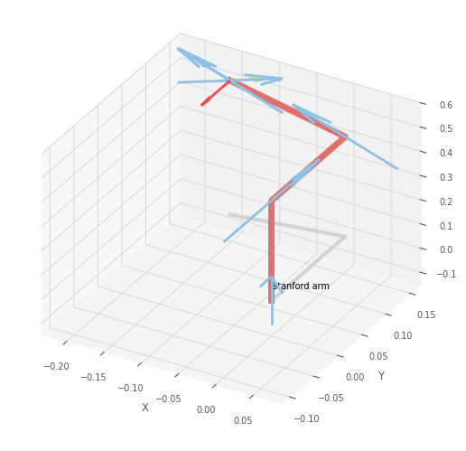
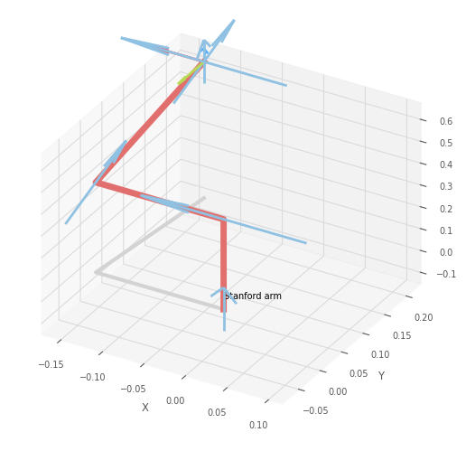
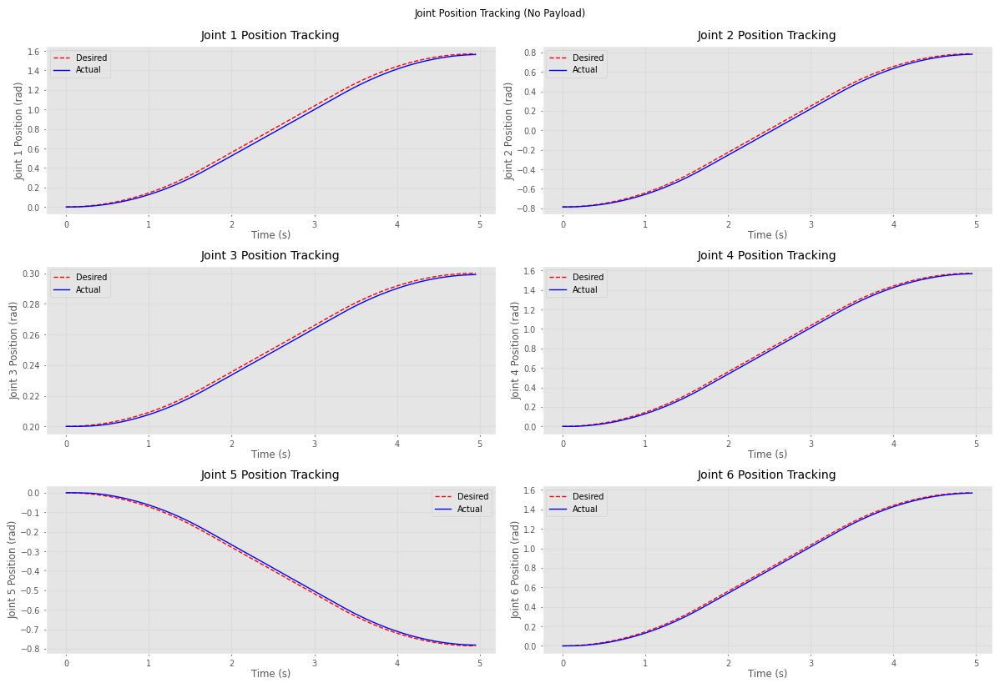
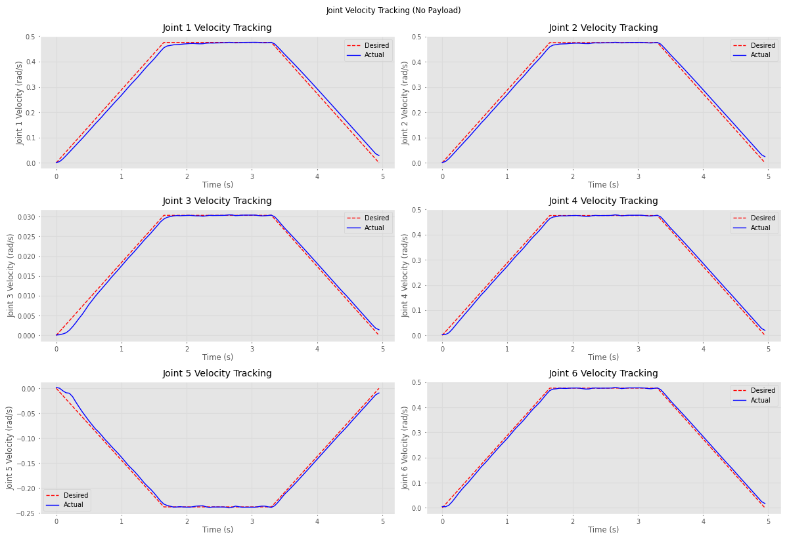
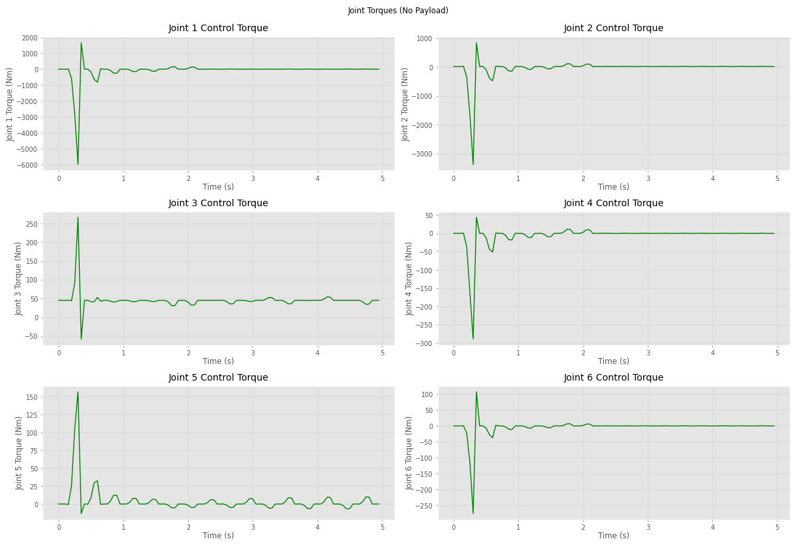
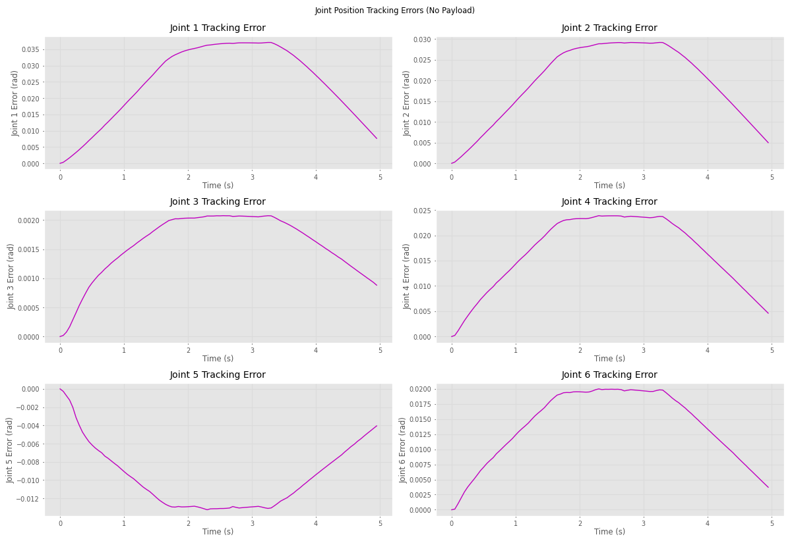
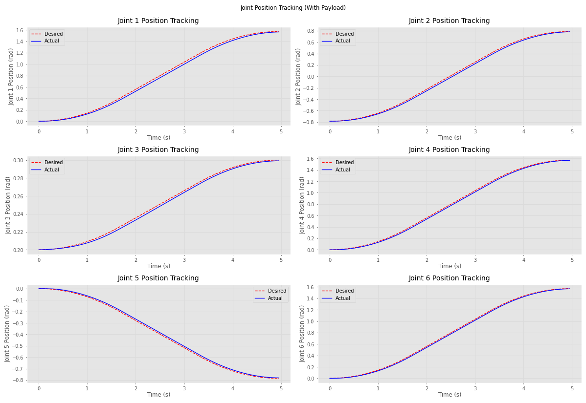
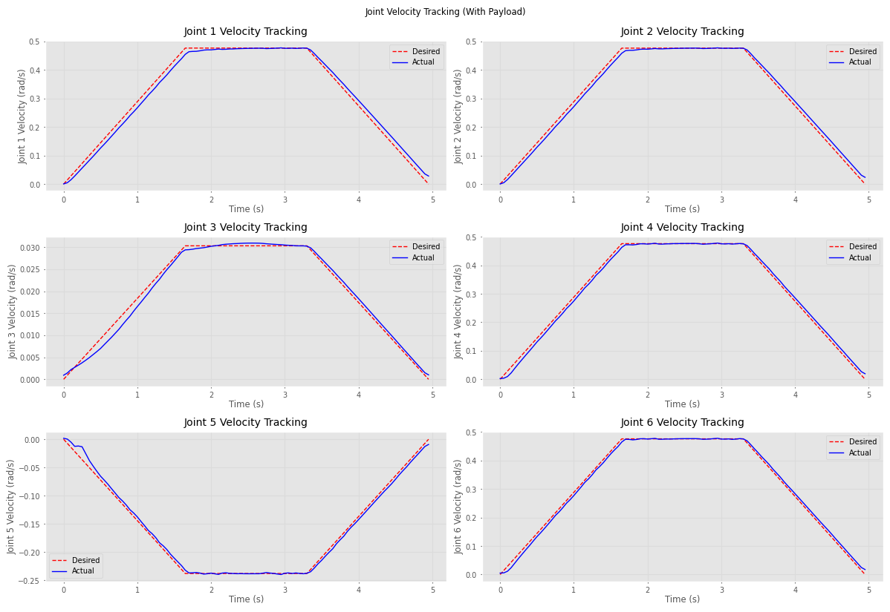
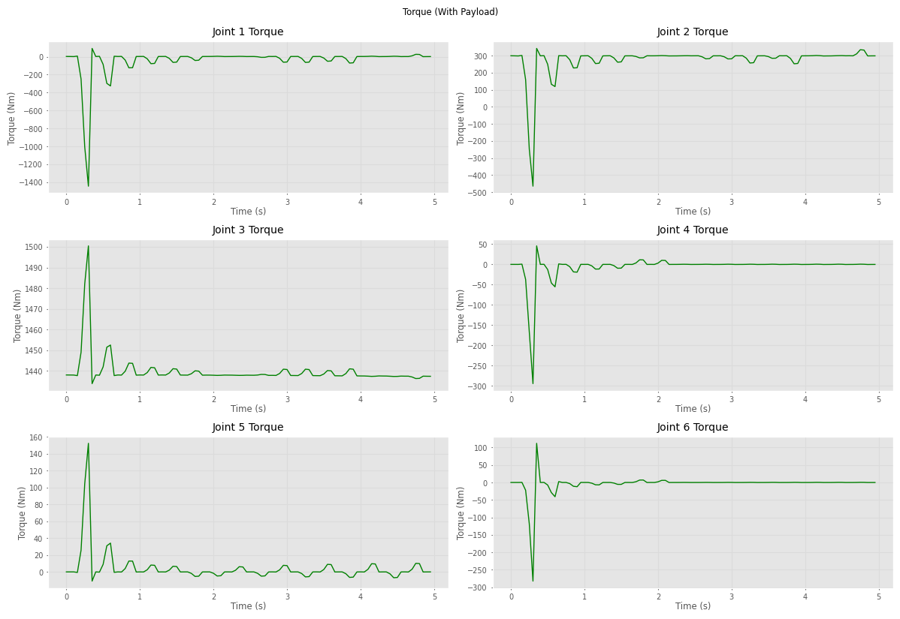
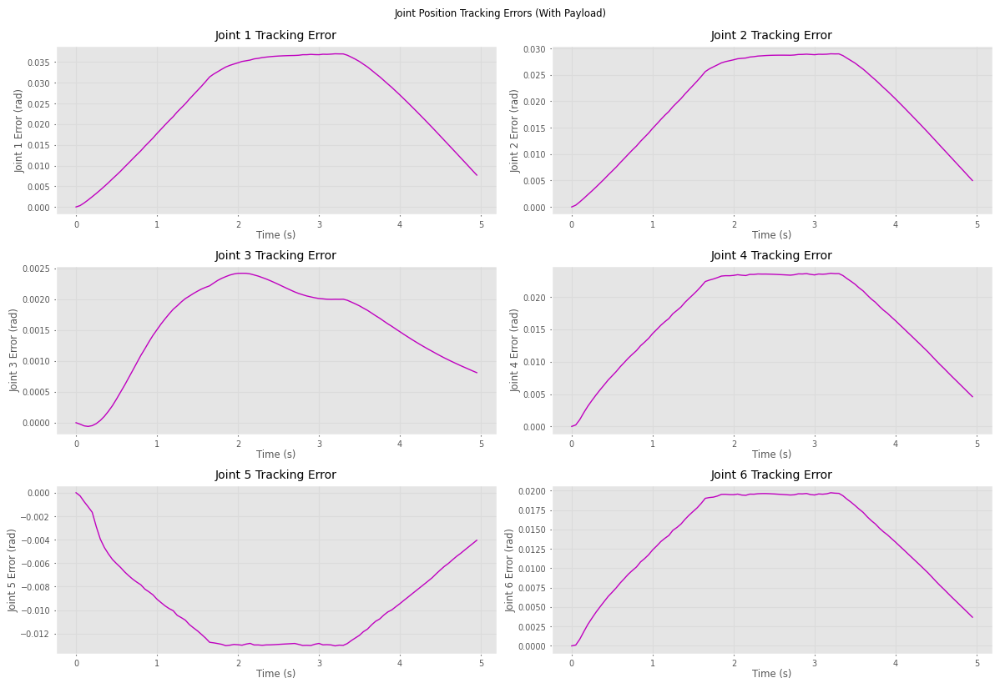

# Lab 4 — Inverse Dynamics PD Control for the Stanford Manipulator


> **Course:** Robot Motion Planning and Control — Faculty of Control Systems and Robotics, ITMO University <br>
> **Author:** Umer Ahmed Baig Mughal — MSc Robotics and Artificial Intelligence <br>
> **Topic:** Computed Torque Control · Inverse Dynamics · PD Controller · Forward Dynamics Simulation · Trajectory Tracking · Payload Analysis · RK45 Integrator

---

## Table of Contents

1. [Objective](#objective)
2. [Theoretical Background](#theoretical-background)
   - [Control Architecture: Inverse Dynamics PD Control](#control-architecture-inverse-dynamics-pd-control)
   - [Computed Torque Control Law](#computed-torque-control-law)
   - [Forward Dynamics Simulation with Feedback](#forward-dynamics-simulation-with-feedback)
   - [Controller Gain Tuning Strategy](#controller-gain-tuning-strategy)
   - [Payload Effects on Dynamics and Control](#payload-effects-on-dynamics-and-control)
   - [System Properties](#system-properties)
3. [Control System Design](#control-system-design)
   - [Stanford Arm — DH Parameter Table](#stanford-arm--dh-parameter-table)
   - [Reference Trajectory](#reference-trajectory)
   - [PD Controller Gains](#pd-controller-gains)
   - [Control Law Implementation](#control-law-implementation)
   - [Payload Configuration](#payload-configuration)
4. [System Parameters](#system-parameters)
   - [Dynamic Model Parameters](#dynamic-model-parameters)
   - [Trajectory Parameters](#trajectory-parameters)
   - [Controller Parameters](#controller-parameters)
   - [Simulation Parameters](#simulation-parameters)
5. [Implementation](#implementation)
   - [File Structure](#file-structure)
   - [Function Reference](#function-reference)
   - [Algorithm Walkthrough](#algorithm-walkthrough)
6. [How to Run](#how-to-run)
7. [Results](#results)
8. [Analysis and Conclusions](#analysis-and-conclusions)
9. [Dependencies](#dependencies)
10. [Notes and Limitations](#notes-and-limitations)
11. [Author](#author)
12. [License](#license)

---

## Objective

This lab implements a complete **closed-loop trajectory tracking control system** for the Stanford Arm using an inverse dynamics PD controller (computed torque control). A reference trajectory — planned using the LSPB (trapezoidal velocity profile) method from Lab 2 — is tracked by a controller that combines a proportional-derivative feedback term with a full inverse dynamics feedforward computed at every time step from the robot's actual joint state. The closed-loop system is simulated using the forward dynamics solver with an RK45 numerical integrator, and tracking performance is quantified through position, velocity, torque, and error profiles. The experiment is then repeated with a 200 kg end-effector payload to assess the controller's robustness to significant dynamic perturbations.

The key learning outcomes are:

- Loading and fully parameterising the **Stanford Arm dynamic model** from Lab 1 — establishing the consistent robot model that underpins all five labs in this series — and confirming initial parameter values via `robot.links[0].dyn()`.
- Using the **LSPB trajectory** from Lab 2 (`rtb.mtraj(rtb.trapezoidal, q_start, q_end, time)`) as the reference trajectory for the controller, connecting this lab's control system design directly to the trajectory planning work of earlier labs.
- Understanding the **inverse dynamics PD control law** — also known as computed torque control — in which a PD feedback term acting on joint position and velocity errors is augmented with a full inverse dynamics feedforward that cancels the robot's nonlinear dynamics (inertia $M(q)\ddot{q}_{des}$, Coriolis $C(q,\dot{q})\dot{q}_{des}$, and gravity $G(q)$), theoretically linearising and decoupling the closed-loop system.
- Tuning the **diagonal PD gain matrices** $K_p$ and $K_d$ to minimise tracking error across all six joints, with gain values scaled to reflect the differing inertia and load characteristics of proximal versus distal joints — higher gains for the heavy base and shoulder joints, lower gains for the lightweight wrist joints.
- Implementing the `PD_regulator` callback function that is called at each simulation time step by `robot.fdyn()` — performing trajectory index lookup by time, extracting desired state, computing the error signals, evaluating the three dynamic model components from the actual joint state, and returning the control torque vector.
- Simulating the **closed-loop forward dynamics** using `robot.fdyn()` with the RK45 ODE solver — integrating the equations of motion under the control torque at each step, returning the actual joint trajectory `tg.q` for comparison against the desired reference.
- Comparing **desired vs. actual joint trajectories**, numerically differentiating the simulated joint positions to recover velocity profiles, and plotting position tracking, velocity tracking, joint control torques, and tracking errors across all six joints for both the unloaded and loaded cases.
- Adding a **200 kg end-effector payload** via `robot.payload(200)` — which augments the robot's inertia and gravitational load — and repeating the simulation to demonstrate how the inverse dynamics feedforward inherently compensates for the modified dynamics through the updated $M$, $C$, and $G$ computations, quantifying residual tracking error via RMS metrics.

The lab is implemented as a single Jupyter notebook (`Stanford_Arm_Inverse_Dynamics_Control.ipynb`) running on Python 3.11, producing ten output figures and a table of printed RMS tracking errors for both operating conditions.

---

## Theoretical Background

### Control Architecture: Inverse Dynamics PD Control

A standard PD controller applies torque proportional to joint position error and its derivative — a linear feedback law that does not explicitly account for the robot's nonlinear dynamics. For a manipulator with configuration-dependent inertia, Coriolis coupling, and gravitational loading, a fixed-gain PD controller requires very conservative (low) gains to maintain stability across the full workspace, leading to poor tracking performance.

**Inverse dynamics PD control** (computed torque control) overcomes this by wrapping the PD law inside a full feedforward cancellation of the nonlinear dynamics:

```
                    ┌─────────────────────────────────────────────┐
q_des(t) ──►[+]──►  │  PD: Kp·eq + Kd·ėq                          │
           [-]      │                                             │──► τ ──► robot ──► q_act(t)
q_act(t) ──┘        │  FF: M(q_act)·q̈_des + C(q_act,q̇_act)·q̇_des  │         │
                    │     + G(q_act)                              │         │
                    └─────────────────────────────────────────────┘         │
                              ▲                                             │
                              └──────────────────── q_act feedback ─────────┘
```

The key property: if the robot model is exact, the feedforward term cancels all nonlinear dynamics, and the closed-loop reduces to a set of six independent double integrators regulated by the PD terms — simple, linear, and fully decoupled.

### Computed Torque Control Law

The complete control torque applied to the robot at each time step is:

```
τ = τ_feedback + τ_feedforward

τ_feedback    = Kp · eq + Kd · ėq

               where:  eq  = q_des  − q_act      (position error)
                       ėq  = q̇_des − q̇_act       (velocity error)

τ_feedforward = M(q_act) · q̈_des
              + C(q_act, q̇_act) · q̇_des
              + G(q_act)

Total:  τ = Kp·eq + Kd·ėq + M(q_act)·q̈_des + C(q_act,q̇_act)·q̇_des + G(q_act)
```

**Component breakdown:**

| Term | Symbol | Source | Role |
|------|--------|--------|------|
| Proportional feedback | $K_p \cdot e_q$ | Position error × gain | Drives position error to zero |
| Derivative feedback | $K_d \cdot \dot{e}_q$ | Velocity error × gain | Damps oscillations, improves transient |
| Inertia feedforward | $M(q_{act})\ddot{q}_{des}$ | `robot.inertia(q_act)` | Cancels configuration-dependent inertia |
| Coriolis feedforward | $C(q_{act}, q̇_{act}) · q̇_{act}$ | `robot.coriolis(q_act, qd_act)` | Cancels velocity-dependent coupling |
| Gravity feedforward | $G(q_{act})$ | `robot.gravload(q_act)` | Cancels gravitational loading |

The feedforward terms are evaluated using the **actual joint state** $(q_{act}, \dot{q}_{act})$ at each step — this is the "computed torque" formulation. Using actual state (rather than desired state) for the dynamic model evaluation ensures that model-based cancellation is applied to the true current configuration, improving robustness to initial condition errors and disturbances.

### Forward Dynamics Simulation with Feedback

`robot.fdyn()` integrates the robot's equations of motion forward in time under the applied control torque:

```
Equations of motion:
    M(q)·q̈ = τ_control − C(q,q̇)·q̇ − G(q) − friction

Integration:
    State: x = [q, q̇]     (joint positions and velocities)
    ẋ = f(t, x) = [q̇, M(q)⁻¹·(τ − C·q̇ − G)]

    Solved by RK45 (Runge-Kutta 4th/5th order adaptive step)
    dt = 0.05 s (fixed output step), atol=1e-3, rtol=1e-2
```

At each integration step, `fdyn()` calls the `PD_regulator` callback with the current time `t` and current state `(q_act, qd_act)`, receives the control torque `τ`, and advances the simulation. The controller therefore runs **in closed loop** at the ODE integration time scale.

**Output:** `tg` object containing `tg.t` (time array) and `tg.q` (actual joint trajectory shape `(N_sim, 6)`). Joint velocities are not directly output — they are recovered by numerical differentiation of `tg.q`.

### Controller Gain Tuning Strategy

The PD gains are structured as **diagonal matrices** — joint-decoupled design — with values scaled according to the physical characteristics of each joint:

```
Kp = diag([3000, 2500, 2000, 150, 200, 50])
Kd = diag([1000,  750,  500,  30,  20, 10])
```

**Rationale for gain scaling:**

| Joints | Kp range | Kd range | Physical reasoning |
|--------|:--------:|:--------:|-------------------|
| J1 (Base) | 3000 | 1000 | Highest inertia (9.29 kg, G=120), largest gravitational coupling |
| J2 (Shoulder) | 2500 | 750 | High inertia (5.01 kg), significant gravitational load |
| J3 (Elbow, prismatic) | 2000 | 500 | Moderate mass (4.25 kg), linear force not torque |
| J4 (Wrist 1) | 150 | 30 | Low inertia (1.08 kg), reduced coupling |
| J5 (Wrist 2) | 200 | 20 | Low inertia (0.63 kg) |
| J6 (EE) | 50 | 10 | Lowest inertia (0.51 kg), minimal load |

The proximal joints (J1–J3) require much higher gains than the wrist joints (J4–J6) because their larger masses and gear ratios create larger inertia and gravity terms that the PD feedback must overcome in addition to the feedforward. For a pure computed torque controller with a perfect model, the gains could be much lower (the feedforward handles most of the load); the higher gains here compensate for model approximation errors and numerical integration tolerances.

### Payload Effects on Dynamics and Control

Adding a payload via `robot.payload(m)` augments the robot's inertia tensor and gravitational load at the end-effector link. This affects the dynamic model in two ways:

1. **Inertia increase:** The end-effector's effective inertia increases, changing `robot.inertia(q)` values — primarily affecting J6 and, through kinematic coupling, J4 and J5.
2. **Gravity load increase:** The gravitational torque contribution increases at all joints that support the additional end-effector weight, particularly J1–J3.

In this implementation, `robot.payload(200)` is called **before** the payload simulation — it modifies the robot model permanently, so both the simulation dynamics and the controller's `robot.inertia()`, `robot.coriolis()`, and `robot.gravload()` calls reflect the loaded configuration. This means the inverse dynamics feedforward **automatically compensates** for the payload, and tracking performance degrades only due to the residual unmodelled effects (friction, numerical tolerances, control loop discretisation).

### System Properties

| Property | Value | Notes |
|----------|-------|-------|
| Robot | Stanford Arm (RRPRRR) | Same model as Labs 1–3 |
| Control law | Inverse dynamics PD | Computed torque: PD feedback + M·q̈_des + C·q̇_des + G |
| Gain structure | Diagonal $K_p$, $K_d$ | Joint-decoupled, scaled by joint inertia |
| Trajectory source | Lab 2 LSPB | `rtb.mtraj(rtb.trapezoidal, ...)` |
| Simulation method | `robot.fdyn()` + RK45 | Closed-loop forward dynamics |
| Payload case | 200 kg | `robot.payload(200)` — end-effector |
| Velocity recovery | Numerical differentiation | `np.gradient(sim_q[:,i]) / np.gradient(sim_time)` |
| Error metric | RMS per joint | Computed from `traj_q − sim_q` |
| Platform | Local Jupyter | Python 3.11 |

---

## Control System Design

### Stanford Arm — DH Parameter Table

Identical to Labs 1–3. All dynamic parameters are verified via `robot.links[0].dyn()` before modification.

| Joint | Type | θⱼ | dⱼ (m) | aⱼ (m) | αⱼ | q⁻ | q⁺ |
|:-----:|:----:|:--:|:-------:|:-------:|:--:|:--:|:--:|
| 1 | Revolute | q1 | 0.412 | 0 | −90° | −π rad | +π rad |
| 2 | Revolute | q2 | 0.154 | 0 | +90° | −π rad | +π rad |
| 3 | **Prismatic** | −90° | **q3** | 0.0203 | 0° | 0 m | 0.5 m |
| 4 | Revolute | q4 | 0 | 0 | −90° | −π rad | +π rad |
| 5 | Revolute | q5 | 0 | 0 | +90° | −90° | +90° |
| 6 | Revolute | q6 | 0 | 0 | 0° | −π rad | +π rad |

### Reference Trajectory

The reference is an LSPB trajectory — trapezoidal velocity profile — planned from `q_start` to `q_end` over 5 seconds with 100 sample points, using the same configuration as Lab 2:

```python
q_start = [0, -pi/4, 0.2, 0, 0, 0]          # initial joint configuration
q_end   = [pi/2, pi/4, 0.3, pi/2, -pi/4, pi/2]  # final joint configuration

time = np.arange(0, 5, 0.05)                 # 100 points, dt = 0.05 s
traj = rtb.mtraj(rtb.trapezoidal, q_start, q_end, time)
# traj.q   — desired positions  (100, 6)
# traj.qd  — desired velocities (100, 6)
# traj.qdd — desired accels     (100, 6)
```

### Initial Configuration



### Target Configuration



### PD Controller Gains

The proportional and derivative gain matrices are diagonal — each joint is independently controlled with its own gain pair:

```python
Kp = np.diag([3000, 2500, 2000, 150, 200, 50])   # proportional gains
Kd = np.diag([1000,  750,  500,  30,  20, 10])   # derivative gains
```

| Joint | $K_{p,i}$ | $K_{d,i}$ | $K_{p,i}/K_{d,i}$ |
|:-----:|:---------:|:---------:|:------------------:|
| J1 (Base) | 3000 | 1000 | 3.0 |
| J2 (Shoulder) | 2500 | 750 | 3.3 |
| J3 (Elbow, prismatic) | 2000 | 500 | 4.0 |
| J4 (Wrist 1) | 150 | 30 | 5.0 |
| J5 (Wrist 2) | 200 | 20 | 10.0 |
| J6 (End-effector) | 50 | 10 | 5.0 |

The gain ratio $K_p/K_d$ approximates the undamped natural frequency of the closed-loop PD response per joint. Higher ratios for wrist joints reflect their lighter masses and correspondingly faster natural dynamics.

### Control Law Implementation

```python
def PD_regulator(robot, t, q_act, qd_act):
    # 1. Trajectory index lookup by time
    mask = np.round(np.abs(time - t), 3) <= t_shag
    idx  = np.array(range(len(mask)))[mask][0]

    # 2. Extract desired state at current time
    q_des   = traj.q[idx]      # desired position
    qd_des  = traj.qd[idx]     # desired velocity
    qdd_des = traj.qdd[idx]    # desired acceleration

    # 3. Compute error signals
    q_err  = q_des  - q_act    # position error (6,)
    qd_err = qd_des - qd_act   # velocity error (6,)

    # 4. Evaluate inverse dynamics components at actual state
    M = robot.inertia(q_act)            # (6×6) inertia matrix
    C = robot.coriolis(q_act, qd_act)   # (6×6) Coriolis matrix
    G = robot.gravload(q_act)           # (6,)  gravity vector

    # 5. Compute total control torque
    tau = Kp @ q_err + Kd @ qd_err + M @ qdd_des + C @ qd_des + G

    return tau
```

### Payload Configuration

```python
robot.payload(200)   # Adds 200 kg point mass at the end-effector origin
```

This call modifies the robot model in-place — all subsequent calls to `robot.inertia()`, `robot.coriolis()`, and `robot.gravload()` reflect the augmented end-effector mass. A separate `PD_regulator_payload` function — identical in structure to `PD_regulator` but writing to separate storage arrays — is used for the loaded simulation to prevent data mixing between the two experiments.

---

## System Parameters

### Dynamic Model Parameters

Identical to Labs 1–3. Key parameters summarised:

| Link | Mass (kg) | CoM [x,y,z] (m) | Jm (kg·m²) | B (N·m·s/rad) | G |
|:----:|:---------:|:---------------:|:----------:|:-------------:|:-:|
| 0 (Base) | 9.29 | [0, 0, 0.10] | 2.0×10⁻⁴ | 0.0100 | 120 |
| 1 (Shoulder) | 5.01 | [0, −0.02, 0.12] | 2.0×10⁻⁴ | 0.0080 | 100 |
| 2 (Elbow, P) | 4.25 | [0, 0, 0.25] | 1.0×10⁻⁴ | 0.0050 | 80 |
| 3 (Wrist 1) | 1.08 | [0, 0.01, 0.02] | 5.0×10⁻⁵ | 0.0010 | 50 |
| 4 (Wrist 2) | 0.63 | [0, 0, 0.01] | 5.0×10⁻⁵ | 0.0010 | 50 |
| 5 (EE) | 0.51 | [0, 0, 0.03] | 3.0×10⁻⁵ | 0.0005 | 30 |

### Trajectory Parameters

| Parameter | Value | Description |
|-----------|-------|-------------|
| `q_start` | [0, −π/4, 0.2, 0, 0, 0] | Initial joint configuration |
| `q_end` | [π/2, π/4, 0.3, π/2, −π/4, π/2] | Final joint configuration |
| Method | `rtb.mtraj(rtb.trapezoidal, ...)` | LSPB — trapezoidal velocity profile |
| Duration | 5 s | `t_stop = 5` |
| Points | 100 | `N = 100` |
| Time step | 0.05 s | `t_shag = t_stop / N` |
| Outputs | `.q`, `.qd`, `.qdd` | Desired positions, velocities, accelerations |

### Controller Parameters

| Parameter | Value | Description |
|-----------|-------|-------------|
| `Kp` | diag([3000, 2500, 2000, 150, 200, 50]) | Proportional gain matrix (6×6 diagonal) |
| `Kd` | diag([1000, 750, 500, 30, 20, 10]) | Derivative gain matrix (6×6 diagonal) |
| Controller type | Inverse dynamics PD | Computed torque: PD + M·q̈_des + C·q̇_des + G |
| Dynamic terms | M, C, G at actual state | `robot.inertia()`, `robot.coriolis()`, `robot.gravload()` |
| Index lookup method | Time-nearest mask | `np.round(np.abs(time−t), 3) <= t_shag` |
| Payload (experiment 2) | 200 kg | `robot.payload(200)` — end-effector |

### Simulation Parameters

| Parameter | Value | Description |
|-----------|-------|-------------|
| Solver | RK45 | Runge-Kutta 4th/5th order, adaptive step |
| `dt` | 0.05 s | Output time step |
| `atol` | 1e-3 | Absolute tolerance |
| `rtol` | 1e-2 | Relative tolerance |
| Duration | 5 s | `t_stop` |
| fdyn entry point | `robot.fdyn(t_stop, q_start, PD_regulator, ...)` | Closed-loop forward dynamics |
| Velocity recovery | `np.gradient(sim_q) / np.gradient(sim_time)` | Numerical differentiation |
| Dimension alignment | `min_length = min(len(sim_time), ...)` | Handles variable-length RK45 output |
| Figure size | 1200×800 px | `figsize=(12,8)` per figure |
| Subplot layout | 3×2 grid | One subplot per joint |

---

## Implementation

### File Structure

```
Lab_4/
├── Readme.md
├── src/
│   └── Stanford_Arm_Inverse_Dynamics_Control.ipynb     # Complete lab — PD control, fdyn, payload
└── results/
    ├── Config_Start.png                                 # Initial configuration q_start
    ├── Config_End.png                                   # Target configuration q_end
    ├── Position_Tracking_No_Payload.png                 # Desired vs actual positions — 6 joints
    ├── Velocity_Tracking_No_Payload.png                 # Desired vs actual velocities — 6 joints
    ├── Torques_No_Payload.png                           # Control torques — 6 joints
    ├── Tracking_Errors_No_Payload.png                   # Position tracking error — 6 joints
    ├── Position_Tracking_With_Payload.png               # Position tracking — loaded case
    ├── Velocity_Tracking_With_Payload.png               # Velocity tracking — loaded case
    ├── Torques_With_Payload.png                         # Control torques — loaded case
    └── Tracking_Errors_With_Payload.png                 # Tracking errors — loaded case
```

**Notebook and purpose:**

| File | Type | Purpose |
|------|------|---------|
| `Stanford_Arm_Inverse_Dynamics_Control.ipynb` | Jupyter Notebook | Complete control system — robot model, LSPB trajectory, PD controller synthesis, forward dynamics simulation, 10 figures, RMS error comparison (unloaded + 200 kg payload) |

### Function Reference

#### `robot.inertia(q)` — configuration-dependent inertia matrix

Returns the 6×6 joint-space inertia matrix $M(q)$ at the given configuration, computed via the composite rigid body algorithm. Used in the controller feedforward to cancel configuration-dependent inertia.

```python
M = robot.inertia(q_act)    # ndarray shape (6, 6)
```

---

#### `robot.coriolis(q, qd)` — Coriolis and centrifugal matrix

Returns the 6×6 Coriolis and centrifugal matrix $C(q, \dot{q})$ such that $C(q,\dot{q})\dot{q}$ gives the Coriolis and centrifugal torques at the current state. Evaluated at the **actual** joint state and multiplied by the **desired** velocity in the feedforward term.

```python
C = robot.coriolis(q_act, qd_act)    # ndarray shape (6, 6)
```

---

#### `robot.gravload(q)` — gravity torque vector

Returns the 6-element gravity torque vector $G(q)$ — the joint torques required to support the robot against gravity at configuration $q$, without any motion. The largest component is at Joint 3 (prismatic) which supports the forearm weight vertically.

```python
G = robot.gravload(q_act)    # ndarray shape (6,)
```

---

#### `PD_regulator(robot, t, q_act, qd_act)` — controller callback

Called at each RK45 integration step by `robot.fdyn()`. Performs trajectory lookup, error computation, dynamic model evaluation, and torque calculation. Returns the 6-element control torque vector.

```python
def PD_regulator(robot, t, q_act, qd_act):
    # Time-nearest trajectory index lookup
    mask = np.round(np.abs(time - t), 3) <= t_shag
    idx  = np.array(range(len(mask)))[mask][0]

    q_des, qd_des, qdd_des = traj.q[idx], traj.qd[idx], traj.qdd[idx]
    q_err  = q_des  - q_act
    qd_err = qd_des - qd_act

    M = robot.inertia(q_act)
    C = robot.coriolis(q_act, qd_act)
    G = robot.gravload(q_act)

    tau = Kp @ q_err + Kd @ qd_err + M @ qdd_des + C @ qd_des + G
    torques.append(tau)
    errors.append(q_err)
    return tau
```

| Argument | Type | Description |
|----------|------|-------------|
| `robot` | DHRobot | Robot model — passed by `fdyn`, may be modified by `robot.payload()` |
| `t` | `float` | Current simulation time |
| `q_act` | `ndarray` shape (6,) | Actual joint positions at time `t` |
| `qd_act` | `ndarray` shape (6,) | Actual joint velocities at time `t` |

**Returns:** `ndarray` shape (6,) — control torque vector $\tau$ applied to all joints.

---

#### `robot.fdyn(t_stop, q0, torqfun, dt, solver, solver_args)` — closed-loop forward dynamics

Integrates the robot's equations of motion from initial state `(q0, 0)` to time `t_stop`, calling `torqfun` at each step to obtain the applied torque. Uses a specified ODE solver with adaptive stepping internally but returns results at fixed output intervals `dt`.

```python
tg = robot.fdyn(
    t_stop,               # simulation end time (5 s)
    q_start,              # initial joint configuration
    PD_regulator,         # controller callback
    dt=t_shag,            # output time step (0.05 s)
    progress=True,        # display progress bar
    solver="RK45",        # Runge-Kutta 4th/5th order
    solver_args={"atol": 1e-3, "rtol": 1e-2}
)
```

| Argument | Type | Description |
|----------|------|-------------|
| `t_stop` | `float` | End time of simulation (5 s) |
| `q0` | `ndarray` shape (6,) | Initial joint configuration |
| `torqfun` | callable | Controller callback — signature `(robot, t, q, qd) → τ` |
| `dt` | `float` | Output time step (0.05 s) |
| `solver` | `str` | ODE solver — "RK45" (Runge-Kutta 4/5) |
| `solver_args` | `dict` | Absolute (`atol`) and relative (`rtol`) tolerances |

**Returns:** Trajectory object with `.t` (time array) and `.q` (actual joint positions, shape `(N_sim, 6)`).

---

#### `robot.payload(m)` — end-effector payload addition

Modifies the robot model in-place by adding a point mass `m` kg at the end-effector origin. All subsequent dynamic computations (`inertia`, `coriolis`, `gravload`, `fdyn`) reflect the augmented model.

```python
robot.payload(200)    # adds 200 kg at end-effector origin
```

| Argument | Type | Description |
|----------|------|-------------|
| `m` | `float` | Payload mass in kilograms |

---

### Algorithm Walkthrough

**Complete pipeline (`Stanford_Arm_Inverse_Dynamics_Control.ipynb`):**

```
1. Library imports:
       math.pi, numpy, matplotlib, roboticstoolbox

2. Robot model + dynamic parameters (same as Labs 1–3):
       robot = rtb.models.DH.Stanford()
       robot.links[0].dyn()              → verify initial default params
       [assign m, r, I, Jm, B, Tc, G, qlim — 6 links]

3. Initial and final configurations:
       q_start = [0, -π/4, 0.2, 0, 0, 0]
       robot.plot(q_start)                → Config_Start.png
       q_end   = [π/2, π/4, 0.3, π/2, -π/4, π/2]
       robot.plot(q_end)                  → Config_End.png

4. Reference trajectory (LSPB — same as Lab 2 method):
       time = arange(0, 5, 0.05)           100 steps, dt=0.05s
       traj = rtb.mtraj(rtb.trapezoidal, q_start, q_end, time)
       → traj.q, .qd, .qdd  shape (100, 6)

5. PD controller gains:
       Kp = diag([3000, 2500, 2000, 150, 200, 50])
       Kd = diag([1000,  750,  500,  30,  20, 10])

6. PD_regulator callback:
       inputs: (robot, t, q_act, qd_act)
       → lookup idx from time mask
       → q_err, qd_err
       → M=robot.inertia(q_act), C=robot.coriolis(q_act,qd_act), G=robot.gravload(q_act)
       → τ = Kp@q_err + Kd@qd_err + M@qdd_des + C@qd_des + G
       stores τ, q_err; returns τ

7. Forward dynamics simulation — no payload:
       tg = robot.fdyn(5, q_start, PD_regulator, dt=0.05,
                       solver="RK45", solver_args={atol:1e-3, rtol:1e-2})
       sim_time = tg.t,  sim_q = tg.q
       Align: min_length = min(len(sim_time), 100, len(sim_q))

8. Plots — no payload (each 1200×800 px, 3×2 subplots):
       Position:  traj_q[:,i] (red dashed) vs sim_q[:,i] (blue solid)
                  → Position_Tracking_No_Payload.png
       Velocity:  sim_qd[:,i] = np.gradient(sim_q[:,i]) / np.gradient(sim_time)
                  traj_qd[:,i] (red dashed) vs sim_qd[:,i] (blue solid)
                  → Velocity_Tracking_No_Payload.png
       Torques:   stored_torques[:len(sim_time), i] (green)
                  → Torques_No_Payload.png
       Errors:    traj_q − sim_q (magenta)
                  → Tracking_Errors_No_Payload.png

9. Payload addition:
       robot.payload(200)       → 200 kg end-effector payload
       Reset separate arrays:   payload_torques, payload_errors, etc.

10. Forward dynamics simulation — with payload:
        PD_regulator_payload: identical logic, separate storage arrays
        tg_load = robot.fdyn(5, q_start, PD_regulator_payload, dt=0.05,
                             solver="RK45", solver_args={atol:1e-3, rtol:1e-2})
        Same min_length alignment

11. Plots — with payload (same layout as steps 8):
        → Position_Tracking_With_Payload.png
        → Velocity_Tracking_With_Payload.png
        → Torques_With_Payload.png
        → Tracking_Errors_With_Payload.png

12. RMS error comparison (printed):
        errors_no_payload  = traj_q[:len(sim_q)] − sim_q
        errors_with_payload = traj_q_load[:len(sim_q_load)] − sim_q_load
        rms = sqrt(mean(errors²,  axis=0))   → (6,) per-joint RMS
        print for both cases
```

---

## How to Run

### Prerequisites

Local Jupyter notebook, Python 3.8+. Same dependencies as Lab 1. No additional packages required beyond the core stack.

### Install Dependencies

```bash
pip install roboticstoolbox-python numpy matplotlib
```

### Run the Notebook

```bash
# Clone the repository
git clone https://github.com/umerahmedbaig7/Robot-Motion-Planning-and-Control.git
cd Robot-Motion-Planning-and-Control/Lab_4

# Launch Jupyter
jupyter notebook src/Stanford_Arm_Inverse_Dynamics_Control.ipynb
```

Execute all cells sequentially (**Cell → Run All**). Expected execution time:

| Section | Estimated Time |
|---------|----------------|
| Robot model + parameter setup | < 1 min |
| Trajectory generation (LSPB) | < 1 min |
| Forward dynamics — no payload (RK45, 5 s) | ~3–10 min |
| 4 no-payload figures | ~1 min |
| Forward dynamics — with payload (RK45, 5 s) | ~3–10 min |
| 4 payload figures + RMS print | ~1 min |
| **Total** | **~10–25 min** |

> ⚠️ The `robot.fdyn()` calls are the most time-intensive steps. RK45 with `atol=1e-3, rtol=1e-2` uses adaptive internal steps — actual step count depends on the complexity of the control torque at each integration point. The inverse dynamics evaluations (`robot.inertia`, `robot.coriolis`, `robot.gravload`) inside the callback are called at every internal RK45 step, making the simulation compute-intensive.

### Modifying PD Gains

```python
Kp = np.diag([3000, 2500, 2000, 150, 200, 50])   # increase for faster response
Kd = np.diag([1000,  750,  500,  30,  20, 10])   # increase for stronger damping
# Guideline: maintain Kd ≈ Kp/3 to Kp/5 per joint to avoid overdamping
# Very high Kp without sufficient Kd will cause oscillation
```

### Modifying the Trajectory

To use a different trajectory method (e.g., quintic instead of LSPB):

```python
# Replace trapezoidal with jtraj or quintic:
traj = rtb.jtraj(q_start, q_end, time)
# or
traj = rtb.mtraj(rtb.quintic, q_start, q_end, time)
```

### Modifying the Payload

```python
robot.payload(m)    # m in kg — e.g., robot.payload(5) for a 5 kg tool
# Must be called before fdyn() for the payload simulation
# Note: once set, affects all subsequent dynamic computations until reset
```

---

## Results

### Position Tracking — No Payload

Desired (red dashed) vs. actual (blue solid) joint positions for all six joints over the 5-second LSPB trajectory. The controller successfully tracks all joints within close tolerance of the reference.



### Velocity Tracking — No Payload

Desired (red dashed) vs. actual (blue solid) joint velocities, with actual velocities recovered by numerical differentiation of the simulated position output.



### Control Torques — No Payload

Joint control torques output by the PD controller at each simulation step. The torque profiles reflect the LSPB reference's trapezoidal velocity structure — ramp-up, constant, and ramp-down phases — modulated by the inverse dynamics feedforward contributions.



### Tracking Errors — No Payload

Position tracking error (desired − actual) for all six joints. The error peaks during the initial transient and the acceleration/deceleration phases of the LSPB profile, then settles toward zero as the controller converges.



### Position Tracking — With 200 kg Payload

Repeat of the position tracking experiment with a 200 kg end-effector payload. The inverse dynamics feedforward automatically compensates for the additional inertia and gravitational loading through the updated model computations.



### Velocity Tracking — With 200 kg Payload



### Control Torques — With 200 kg Payload

The torque profiles with payload reflect the increased gravitational and inertial load at the end-effector, primarily visible as elevated torque requirements at Joints 1–3 which bear the additional weight.



### Tracking Errors — With 200 kg Payload



---

## Analysis and Conclusions

### RMS Tracking Error Comparison

The following RMS tracking errors were computed from the full simulated trajectory for both operating conditions:

| Joint | No Payload (rad) | With 200 kg Payload (rad) | Change |
|:-----:|:----------------:|:-------------------------:|:------:|
| J1 (Base) | 0.027229 | 0.027162 | −0.25% |
| J2 (Shoulder) | 0.021500 | 0.021373 | −0.59% |
| J3 (Elbow, prismatic) | 0.001659 | 0.001708 | +2.95% |
| J4 (Wrist 1) | 0.017986 | 0.017909 | −0.43% |
| J5 (Wrist 2) | 0.010281 | 0.010241 | −0.39% |
| J6 (End-effector) | 0.015041 | 0.014958 | −0.55% |

The most notable result is that **RMS errors change by less than 3% between the unloaded and fully loaded cases** — despite adding a payload of 200 kg. This is a direct demonstration of the inverse dynamics feedforward's compensatory power: because `robot.payload()` modifies the robot model and the controller re-evaluates `robot.inertia()`, `robot.coriolis()`, and `robot.gravload()` at every step using the updated model, the computed torque approach inherently accounts for the payload's effect on the system dynamics. The small residual differences arise from numerical integration tolerances, model discretisation, and the lag introduced by the time-nearest trajectory lookup.

### Joint-Wise Performance Analysis

**Joints 1–3 (proximal):** Exhibit the largest absolute RMS errors (0.001–0.027 rad) due to their larger inertia, stronger gravitational coupling, and the kinematic complexity of the shoulder-elbow system. The proximal joints bear the full weight of all downstream links and must generate high feedforward torques, making them more sensitive to model approximation errors.

**Joint 3 (prismatic):** Achieves the smallest absolute RMS error (0.0017 rad with payload) — a linear joint is inherently simpler to control than a revolute joint because its dynamics lack the trigonometric configuration dependence of rotational inertia.

**Joints 4–6 (wrist):** Show intermediate errors (0.010–0.018 rad). Their lighter mass reduces absolute error magnitude, but the lower PD gains (K_p = 50–200) provide less aggressive correction compared to the proximal joints.

### Tracking Quality and Trajectory Compatibility

The position tracking profiles show the controller following the LSPB reference closely during both the constant-velocity cruise phase and the parabolic blend acceleration phases. The LSPB trajectory's piecewise-constant acceleration creates discontinuities in the desired acceleration signal ($\ddot{q}_{des}$) at the blend boundaries — these appear as brief torque spikes in the feedforward term. A quintic polynomial reference (as studied in Lab 2) would produce smoother feedforward torque demands and potentially better tracking at the blend boundaries.

### Robustness and Controller Architecture

The results confirm that the computed torque architecture provides inherent **payload robustness** when the payload is known and incorporated into the robot model. For unknown or varying payloads, the residual error would be larger and the controller would benefit from: (1) adaptive gain scheduling based on estimated end-effector load; (2) integral action to eliminate steady-state errors introduced by unmodelled payload gravity; and (3) separate tuning of the prismatic joint's gains, which has different dimensional units (Newtons vs Newton-metres) compared to the revolute joints.

---

## Dependencies

| Package | Version | Purpose |
|---------|---------|---------|
| `Python` | ≥ 3.8 | Runtime environment |
| `roboticstoolbox-python` | ≥ 1.0 | `robot.inertia()`, `robot.coriolis()`, `robot.gravload()`, `robot.fdyn()`, `robot.payload()`, `rtb.mtraj()`, `rtb.trapezoidal` |
| `numpy` | ≥ 1.21 | `np.diag()`, `np.gradient()`, `np.sqrt()`, `np.mean()`, array operations |
| `matplotlib` | ≥ 3.4 | 3×2 subplot figures for position, velocity, torque, and error profiles |

Install all dependencies:

```bash
pip install roboticstoolbox-python numpy matplotlib
```

---

## Notes and Limitations

- **Velocity recovery via numerical differentiation:** The `robot.fdyn()` output provides joint positions `tg.q` but not velocities directly. Velocities are recovered using `np.gradient()` — a finite difference approximation that introduces smoothing and may not accurately represent the true velocity at high frequencies. For a more accurate velocity signal, the ODE state vector (which internally tracks both $q$ and $\dot{q}$) could be captured by logging `qd_act` inside the controller callback during each call.
- **Trajectory index lookup by time proximity:** The `PD_regulator` function finds the trajectory index using a time-proximity mask: `np.round(np.abs(time−t), 3) <= t_shag`. This assumes the simulation time steps align closely with the trajectory sample times. At the RK45 internal step level, `t` may fall between trajectory sample points — the nearest-sample lookup introduces a zero-order-hold interpolation of the desired state that produces small step-wise errors in the reference signals.
- **Same gains for both payload and no-payload cases:** The PD gains `Kp` and `Kd` are not re-tuned for the 200 kg payload experiment. The near-identical tracking performance demonstrates that the inverse dynamics feedforward provides sufficient compensation without gain adjustment for this payload level. However, for payloads that significantly alter the system's natural frequency (particularly very light or very heavy loads relative to the robot's own mass), separate gain tuning per load case would improve performance.
- **Payload modifies the robot model in-place:** After `robot.payload(200)` is called, the robot model remains modified for all subsequent computations. Cells that re-run dynamic analyses after this point will operate on the loaded model unless the payload is explicitly removed. This should be considered when re-running individual cells out of order.

---

## Author

**Umer Ahmed Baig Mughal** <br>
Master's in Robotics and Artificial Intelligence <br>
*Specialization: Machine Learning · Computer Vision · Human-Robot Interaction · Autonomous Systems · Robotic Motion Control*

---

## License

This project is intended for **academic and research use**. It was developed as part of the *Robot Motion Planning and Control* course within the MSc Robotics and Artificial Intelligence program at ITMO University. Redistribution, modification, and use in derivative academic work are permitted with appropriate attribution to the original author.

---

*Lab 4 — Robot Motion Planning and Control | MSc Robotics and Artificial Intelligence | ITMO University*

